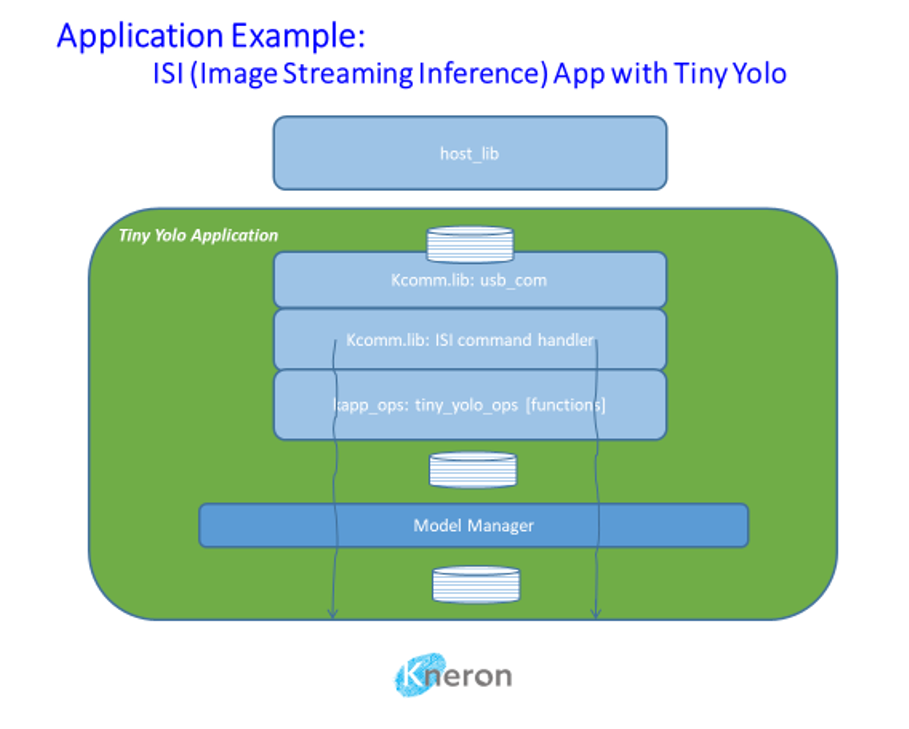

## 1. Environment Setup
### 1.1. Linux
#### Install libusb

`sudo apt install libusb-1.0-0-dev`

### 1.2. Windows(MINGW64/MSYS)
#### 1.2.1. WinUSB installation

You will need administrator’s rights to perform the installation.

When a Kneron device is connected to a Windows PC for the very first time, Windows might report that it failed to find a USB driver automatically.

This section explains how-to install the driver manually.

The instruction is valid for Windows 10 version only.

1. Download **Zadig** application from [zadig.akeo.ie](https://zadig.akeo.ie/) appropriate for Windows 10.
2. Connect Kneron device to your PC.
3. Run the Zadig application.
    The application should detect device as "**Unknown Device #1**" with USB ID "**3231/0200**" and the screen should look like that:

    

    Make sure that the **Driver** field, has **WinUSB** option selected.

4. Click "Install Driver" button.

When installation process is finished, "**Unknown Device #1**" can be found in Windows Device Manager under **Universal Serial Bus Devices** tree node.

#### 1.2.2. Environment, gcc, etc.
Get [git for windows SDK (MUST BE!)](https://gitforwindows.org/) installed

#### 1.2.3. Install libusb

`pacman -S mingw-w64-x86_64-libusb`

#### 1.2.4. Install cmake

`pacman --needed -S mingw-w64-x86_64-cmake`

> Make sure you are using `/mingw64/bin/cmake`

#### 1.2.5. Install opencv_3.4
Get [opencv_3.4.1, mingw-w64-x86_64-opencv-3.4.1-1-any.pkg.tar.xz](https://repo.msys2.org/mingw/x86_64/) installed:

`pacman -U mingw-w64-x86_64-opencv-3.4.1-1-any.pkg.tar.xz`

> Make sure you enter the directory of opencv xz file in msys command line


## 2. File Structure

The whole SDK package is composed of device firmware, Kneron models, and Khost library.  The Khost will be released by a separated repository and will have separated document to describe its folder design. Here, we just talk about the folders for device firmware and Kneron released models.

### 2.1. Basic Concept
The basic concept of FW folder structure is modularize and stratification for all source code. FW code belonged to same feature will be put to one dedicated folder and easy to include/exclude it. Refer to basic FW architecture shown below, the listed items will have corresponding folders.


Here is the example folder design for Kneron SDK.  The <font color="#000066">**dark blue and bold** </font>fonts are mandatory folder name used in SDK. The normal words may vary in different SDK release or depends on your project.

├───<font color="#000066">**firmware**</font><br>
│   ├───<font color="#000066">**app**</font><br>
│   ├───<font color="#000066">**build**</font><br>
│   │   └───<font color="#000066">**solution_**</font>companion<br>
│   │       ├───<font color="#000066">**main_scpu**</font><br>
│   │       │   └───include<br>
│   │       └───sn72096_9x9<br>
│   │           └───scpu_keil<br>
│   ├───<font color="#000066">**include**</font><br>
│   ├───<font color="#000066">**mdw**</font><br>
│   │   ├───console<br>
│   │   ├───dfu<br>
│   │   ├───errand<br>
│   │   ├───flash<br>
│   │   ├───include<br>
│   │   ├───ipc<br>
│   │   ├───memory<br>
│   │   ├───model<br>
│   │   ├───power<br>
│   │   ├───spi_com<br>
│   │   ├───ssp<br>
│   │   ├───system<br>
│   │   ├───tdc<br>
│   │   ├───usbd_com<br>
│   │   ├───usbh2<br>
│   │   └───utilities<br>
│   ├───<font color="#000066">**platform**</font><br>
│   │   ├───<font color="#000066">**board**</font><br>
│   │   │   └───<font color="#000066">**board_**</font>sn72096_9x9<br>
│   │   ├───<font color="#000066">**dev**</font><br>
│   │   │   ├───eeprom<br>
│   │   │   ├───include<br>
│   │   │   ├───nand<br>
│   │   │   │   ├───gigadevice<br>
│   │   │   │   └───winbond<br>
│   │   │   ├───nor<br>
│   │   │   └───wifi<br>
│   │   │       ├───BufList<br>
│   │   │       └───ESP8266<br>
│   │   │           ├───CMSIS_DV_Results<br>
│   │   │           └───Config<br>
│   │   └───<font color="#000066">**kl720**</font><br>
│   │       ├───<font color="#000066">**common**</font><br>
│   │       └───<font color="#000066">**scpu**</font><br>
│   │           ├───<font color="#000066">**drv**</font><br>
│   │           │   └───include<br>
│   │           ├───<font color="#000066">**rtos**</font><br>
│   │           │   └───rtx<br>
│   │           │       └───include<br>
│   │           └───<font color="#000066">**startup**</font><br>
│   └───<font color="#000066">**utils**</font><br>
│       ├───bin_gen<br>
│       │   └───flash_bin<br>
│       ├───<font color="#000066">**dfu**</font><br>
│       │   └───src<br>
│       ├───<font color="#000066">**flash_programmer**</font><br>
│       │   ├───nand<br>
│       │   └───nor<br>
│       ├───<font color="#000066">**JLink_programmer**</font><br>
│       │   ├───bin<br>
│       │   └───Devices<br>
│       │       └───Kneron<br>
│       │           └───Winbond<br>
│       └───spl_aes<br>
└───<font color="#000066">**models**</font><br>
    ├───yolov3_416<br>
    ├───yolov3_608<br>
    ├───yolov3_tiny_416<br>
    └───yolov3_tiny_608<br>


### 2.2. Detailed explanation

├───<font color="#0000dd">**firmware**</font><br>
└───<font color="#0000dd">**models**</font>

<font color="#0000dd">**firmware:**</font> Contains all device FW source/lib code, utilities, build environment

<font color="#0000dd">**models:**</font> Contains all Kneron compiled models which is used by firmware examples. Models will also be called by Khost, so, it must be located at same level as firmware and Khost.

├───firmware<br>
│   ├───<font color="#0000dd">**app**</font><br>
│   ├───<font color="#0000dd">**build**</font><br>
│   ├───<font color="#0000dd">**include**</font><br>
│   ├───<font color="#0000dd">**mdw**</font><br>
│   ├───<font color="#0000dd">**platform**</font><br>
│   └───<font color="#0000dd">**utils**</font><br>

Basically, the firmware source_code=app+mdw+platform(+include). We hope all firmware source code will be put under these 3 folders and will not be influenced by any projects, that is, it's a source code data base. All project related code will be put under build folder.

<font color="#0000dd">**app:**</font> All application firmware code. Every module or C file have prefix kapp_.

<font color="#0000dd">**build:**</font> Build environment. Include (Keil) project files, workspace, main.c, makefiles. C source files will be pulled in a project and then engineer generates a new project.

<font color="#0000dd">**include:**</font> C header files for all source code

<font color="#0000dd">**mdw:**</font> Middleware. It's kind of "service", "manager". We can put some useful and special purpose pure software feature here, such as file system, software timer, DFU function, memory management.

<font color="#0000dd">**platform:**</font> It means a HW platform or a SoC for AI development. Platform consists of an SoC, a PCB, and some onboard devices(flash, eeprom...).

<font color="#0000dd">**utils:**</font> some useful utilities, such as flash programming, calculate checksum...

├───firmware<br>
│   ├───build<br>
│   │   ├───<font color="#0000dd">**example_**</font>xxx<br>
│   │   ├───<font color="#0000dd">**lib**</font><br>
│   │   ├───<font color="#0000dd">**solution_**</font>xxx<br>

There are two major components in build folder, example projects and solution projects. As the name implies, small app demo, simple peripheral drivers demo, or any features demonstration belong to example projects. The purpose is to show how to use our SDK. Solution projects is a solution for customer. It contains more features, or complex functions in a single project. 
Example projects will have example_ prefix and solution projects will have solution_ prefix.
If you need to build a library and share with other projects, create lib projects in lib folder.

<font color="#0000dd">**example_**</font> : a prefix for example project. ex. example_i2c, example_tiny_yolo

<font color="#0000dd">**solution_**</font> : a prefix for solution project. ex. solution_companion, solution_door_lock

<font color="#0000dd">**lib:**</font> Some source files need to be hidden or need to generate library. Put the library project here

├───firmware<br>
│   ├───mdw<br>
│   │   ├───<font color="#0000dd">**console**</font><br>
│   │   ├───<font color="#0000dd">**dfu**</font><br>
│   │   ├───<font color="#0000dd">**errand**</font><br>
│   │   ├───<font color="#0000dd">**flash**</font><br>
... ...

Collect independent modules to become middle ware here.
It can be generic flash driver, firmware upgrade manager, file system...etc.

├───firmware<br>
│   ├───platform<br>
│   │   ├───<font color="#0000dd">**board**</font><br>
│   │   ├───<font color="#0000dd">**dev**</font><br>
│   │   │   ├───eeprom<br>
│   │   │   ├───nand<br>
│   │   │   ├───nor<br>
│   │   │   └───wifi<br>
│   │   └───<font color="#0000dd">**kl720**</font><br>
│   │       ├───common<br>
│   │       └───scpu<br>
│   │           ├───drv<br>
│   │           ├───rtos<br>
│   │           └───startup<br>

Platform = board + dev + ASIC. 

<font color="#0000dd">**board**</font>: PCB information, flash size, IO mapping, 

<font color="#0000dd">**dev**</font>: device drivers, such as flash driver, eeprom driver, wifi module driver, panel driver, sensor driver

<font color="#0000dd">**kl720**</font>: contain all peripheral drivers, real time OS, startup assembly code, and FW init code.


## 3. host_lib Compile and Build

### 3.1. Linux
#### 3.1.1. Build
```bash
mkdir build && cd build
 # to build opencv_3.4 example: cmake -DBUILD_OPENCV_EX=on ..
cmake ..
make -j4
```

#### 3.1.2. USB Device Permissions
Add the following to /etc/udev/rules.d/10-local.rules
```
KERNEL=="ttyUSB*",ATTRS{idVendor}=="067b",ATTRS{idProduct}=="2303",MODE="0777",SYMLINK+="kneron_uart"
KERNEL=="ttyUSB*",ATTRS{idVendor}=="1a86",ATTRS{idProduct}=="7523",MODE="0777",SYMLINK+="kneron_pwr"
SUBSYSTEM=="usb",ATTRS{idVendor}=="3231",ATTRS{idProduct}=="0200",MODE="0666"
```

### 3.2. Windows(MINGW64/MSYS)
#### 3.2.1. Build
```bash
 # to build opencv_3.4 example: cmake -DBUILD_OPENCV_EX=on .. -G"MSYS Makefiles"
mkdir build && cd build
cmake .. -G"MSYS Makefiles"
make -j4
```

#### 3.2.2. Runtime DLL Environment
- Set PATH to add CV DLL location in Windows10
    - Command line example: assume MSYS2 is installed in C:\git-sdk-64\mingw64

    ```
    set PATH=%PATH%;C:\git-sdk-64\mingw64\bin
    ```

- Copy additional DLLs to C:\git-sdk-64\mingw64 directory

    ```
    cp dll\*.dll C:\git-sdk-64\mingw64\bin\
    ```


### 3.3. Output Bin Files
|  | host_lib library | Example executable file |
|------------------|------------------|-------------------------|
| **Linux** | ./build/src/libhostkdp.so | ./build/bin_kdp720/* |
| **Windows** | ./build/bin/libhostkdp.dll | ./build/bin_kdp720/*.exe |

## 4. Flash Management

### 4.1. Board Overview


### 4.2. Hardware Setting

#### 4.2.1. Connecting UART0 (Program Flash via UART0 Interface)

UART0: Command Port (either CN10 or J8)


#### 4.2.2. Connecting JTAG (Program Flash via JTAG/SWD Interface)

#### 4.2.3. Connecting USB3.0 for 5V power supply

### 4.3. Program Flash via UART0 Interface

#### 4.3.1. Flash programmer necessaries

1. Open command terminal for flash programmer execution

    Tool path: kl720_sdk\firmware\utils\flash_programmer\nand\flash_programmer.py

2. install Necessary python modules: kl720_sdk\firmware\utils\flash_programmer\requirements.txt

#### 4.3.2. Edit python verification setting

1. Check UART port number from device manager

2. Edit setup.py, search “COM_ID” and modify the ID to match your UART port number

    ex: COM_ID = 3 # COM3


#### 4.3.3 Flash Chip Programming (FW + DATA)

`>> python flash_programmer.py -a flash_fdfr_image.bin`

Please press RESET BTN while you are seeing “Please press reset button!!”


Afterwards, just wait until all progresses are finished (erase, program, verify)


**Note**:
"flash_programmer.py -a" means to do flash chip erase + programming + verification

#### 4.3.4 Flash Verification (optional)

`>> python flash_programmer.py -v flash_fdfr_image.bin`

#### 4.3.5 Flash Erase (optional)

`>> python flash_programmer.py -e`

#### 4.3.6 Flash Partial Programming (optional)

`>> python flash_programmer.py -i 0x00040000 -p fw_scpu.bin`

**Note**:
To program specific bin file to specific flash address
"-i" means the flash index/address you would like to program
"-p" means the FW code you would like to program


### 4.4. Program Flash via JTAG/SWD Interface

#### 4.4.1. Jlink programmer necessaries

Connect JTAG/SWD and USB3.0 for 5V power.


#### 4.4.2. Edit flash_prog.jlink device setting

1. Check your flash type: Winbond SPI Nand flash 

2. Select a specific device based on flash manufacturer
    EX: device KL720-WB-NAND //Winbond Nand flash

3. Copy the bin file to kl720_sdk\firmware\utils\JLink_programmer\bin folder
    EX: flash_fdfr_image.bin, boot_spl.bin, fw_scpu.bin, fw_ncpu.bin, fw_ncpu_dram.bin etc.


#### 4.4.3. Double click "flash_prog.bat"

Afterwards, just wait until all progresses are finished (chip erase, program, verify)


#### 4.4.4. Check programming result

Please ensure all the results are "O.K.", and enter "qc" to quit and close J-Link commander


#### 4.4.5. Edit flash_prog_partial.jlink device setting(optional)

To program ncpu fw or update models to specific flash address(sector erase, program, verify)

1. "flash_ncpu.jlink" loadbin command: Load *.bin file into target memory

    **Syntax**:

    `loadbin <filename>, <addr>`

    `loadbin .\bin\fw_ncpu_dram.bin,0x000E0000`

    `loadbin .\bin\fw_ncpu.bin,0x001E0000`

2. Double click “flash_ncpu.bat” and wait until all progresses are finished

3. Check programming result
    Please ensure the results is “O.K.”, and enter “qc” to quit and close J-Link commander
    EX:
    

4. Same to "flash_models.bat".

## 5. Run samples

### 5.1. Run sample on Ubuntu 18.04

Define folder path below:

* **EXAMPLE_FOLDER** :

    `host_lib/build/bin_kdp720`

* **TINY_YOLO3_416_MODEL_FOLDER** :

    `[SDK folder]/models/yolov3_tiny_416`

* **TINY_YOLO3_608_MODEL_FOLDER** :

    `[SDK folder]/models/yolov3_tiny_608`

* **YOLO3_416_MODEL_FOLDER** :

    `[SDK folder]/models/yolov3_416`

* **YOLO3_608_MODEL_FOLDER** :

    `[SDK folder]/models/yolov3_608`

#### 5.1.1. Run Tiny YOLO v3 416x416 host_lib sample

* Copy the Tiny YOLO v3 model files (**all_models.bin** and **fw_info.bin**) from **TINY_YOLO3_416_MODEL_FOLDER** to **EXAMPLE_FOLDER**
* Open terminal and change directory to **EXAMPLE_FOLDER**
* Load model into device

    1. Execute kl720_dme_load_model

        This app will look for fw_info.bin and all_models.bin in same directory and then download all_models.bin through USB interface to KL720 device

        `sudo ./kl720_dme_load_model`

    2. Logs will be shown in terminal

        

* Run sample

    1. Execute kl720_isi_yolo with parameters **[parallel]** **[test_times]**

        `sudo ./kl720_isi_yolo 1 10`

        (1) **[parallel]** 0 for serial mode and 1 for parallel mode

        (2) **[test_times]** 0 for infinite mode and non-zero is how many times you want to test

    2. Logs will be shown on terminal

        

#### 5.1.2. Run Tiny YOLO v3 608x608 host_lib sample

Repeat section 5.1.1 and use the model from folder **TINY_YOLO3_608_MODEL_FOLDER**.

#### 5.1.3. Run YOLO v3 416x416 host_lib sample

Repeat section 5.1.1 and use the model from folder **YOLO3_416_MODEL_FOLDER**.

#### 5.1.4. Run YOLO v3 608x608 host_lib sample

Repeat section 5.1.1 and use the model from folder **YOLO3_608_MODEL_FOLDER**.

#### 5.1.5. Run CenterNet+MobileNet Khost sample

* The images for testing of this sample are as below.

    `host_lib/test_images/si/image1_small.bin`

    `host_lib/test_images/si/image2_small.bin`

    `host_lib/test_images/si/image3_small.bin`

    `host_lib/test_images/si/image4_small.bin`

    `host_lib/test_images/si/image5_small.bin`

    `host_lib/test_images/si/image5_large.bin`

* Image format :

    |  | Format | Resolution |
    |-----|-----|-----|
    | **Small** | RGB565 | 512x375 |
    | **Large** | RGB565 | 1920x1080 |

* Open terminal and change directory to **EXAMPLE_FOLDER**
* Send model and config to device

    1. Execute kl720_si_config

        `sudo ./kl720_si_config`

    2. Logs will be shown in terminal

        

* Run sample

    1. Execute kl720_si_od2pass with parameters **[delay]** **[test_times]**

        `sudo ./kl720_si_od2pass 100 6`

        (1) **[delay]** delay time in millisecond

        (2) **[test_times]** 0 for infinite mode and non-zero is how many times you want to test

    2. Logs will be shown on terminal

        

* **NOTE**

    The demo program will cycle through 5 LD (512x375) images, doing Centernet on each.
    For image #5, it will use the object detected and send in the HD version (1920x1080)
    as image #6, for Mobilenet processing. Command window will show logs for each LD image with detection results and the HD image with classification results.

    The current kl720_si_od2pass is written in similar manner as the isi example that sends in two images (#1 & #2) initially and then receives the results from #1, followed by sending image #3, receives #2, and so on.  At the end, after sending in image #n, it will receive results for #n-1 and #n, followed by a computed FPS number.

    NOTE: The FPS computation is based on the starting time of the test run and concludes when the run is completed (elapsed time / session count) so the drawing speed and PC performance will impact the FPS.  The actual 720 performance is better than the FPS shown.


### 5.2. Run sample on Windows 10

Almost the same as section 5.1 on Ubuntu 18.04, there are 2 parts different.

1. Executable file extension is **exe**.

2. Replace **Ubuntu Terminal** by **Windows Command**.

    

    

    

    


## 6. Create New SDK Application

### 6.1. KL720 Firmware Architecture

KL720 firmware is consisted of two bootloaders, IPL and SPL, and two RTOS (Real Time Operating System) images running on system cpu (SCPU) and NPU-assisting cpu (NCPU) which is DSP.

When IPL (Initial Program Loader) in ROM starts to run on SCPU after power-on or reset, it loads SPL (Secondary Program Loader) from flash (automatically or type 1 in UART menu), then SPL loads SCPU firmware image from flash, and finally SCPU firmware loads NCPU firmware image which runs on NCPU.

Both SCPU and NCPU firmware run RTOS with SCPU handling application, media input/output and peripheral drivers and NCPU handling CNN model pre/post processing. Two CPUs use interrupts and shared memory to achieve IPC (Inter Processor Communication).


### 6.2. Firmware components

| Binary | Description |
|------------------|------------------|
| fw_scpu.bin | Complete firmware binary for SCPU (Cortex-M4)<br>Size 128Kbytes with checksum at last 4bytes |
| fw_ncpu.bin | Complete firmware binary for NCPU (DSP)<br>Size 2MB with checksum at last 4bytes |
| boot_spl.bin | bootloader binary<br>boot_spl loads scpu firmware to RAM |


### 6.3. Application Architecture

An application is consisted of one or multiple CNN models for specific purposes, and corresponding preprocessing and postprocessing.
There are many kinds of applications depending on specific use cases. Some application could have their image processing streamlined for best performance and some may not. Some applications could have multiple models, and some may have single model.

Tiny Yolo is a single model application with streamlined processing. Both companion mode and host mode are supported. Figure below is a companion mode example. 




### 6.4. Create New Application Project

#### 6.4.1 Create steps
* Create new application project by copying an existing application project in the path **firmaware/build/[example_xxx, solution_xxx]**
* Find **main.c** and **project.h** and modify properly if needed:
    * **main.c**: app, middleware
    * **project.h**: driver, pcb, ic, memory, flash

#### 6.4.2 Use existing application project as template
* Example: **firmware/build/solution_companion/**
* Copy whole directory to a new one, for example: **firmware/build/my_project/**
* Modify firmware/build/solution_companion/main_scpu/**main.c**
* Modify firmware/build/solution_companion/sn72096_9x9/**project.h**

### 6.5. Create New NCPU Project

* KL720 NCPU is provided by binary file.


### 6.6. Create New Workspace to Include All Projects (Optional)

* Use existing application’s workspace as template

Copy the workspace.uvmpw file to your directory, add/remove projects as needed.

`firmware/build/solution_companion/sn72096_9x9/proj_yolo.uvmpw`

A companion application workspace usually contains these projects:

```
Project:scpu-sdk
Project:solution_companion
```

### 6.7. Create ISI Companion Application

Main tasks in main.c

* Initialize OS
* Initialize SDK with companion mode
`main_init(0)`
* Load ncpu firmware
`main_load_ncpu(0)`
* Initialize communication module
`kcomm_start()`

Add operations for ISI command handler, e.g. in a shared directory/file (firmware/app/tiny_yolo_ops.c):
```
static struct kapp_ops kapp_tiny_yolo_ops = {
    .start          = tiny_yolo_start,
    .run_image      = tiny_yolo_run_image,
    .get_result_len = tiny_yolo_get_result_len,
};

/**
  .start: check application id at init time
  .run_image: pass image and parameters to middleware driver to
              run with the model(s) (model id TINY_YOLO_V3 here) 
              of the application
  .get_result_len: tell the length in bytes of a result buffer
**/

struct kapp_ops *tiny_yolo_get_ops(void)
{
    return &kapp_tiny_yolo_ops;
}
```

Register new ops with ISI command handler:
```
struct kapp_ops *ops;

ops = tiny_yolo_get_ops();
kcomm_enable_isi_cmds(ops);
```

#### Support multiple models:

When an application includes multiple models, each model needs a separate result memory, and all result memory buffers must be allocated in DDR using kmdw_ddr_reserve() because they are filled up by NCPU.

For companion mode this can be all done in .run_image callback function like age_gender ISI example where two models (KNERON_FDSSD and KNERON_AGE_GENDER) are run one after another.
`firmware/app/kapp_center_app_ops.c`

#### Parallel image processing for NPU and NCPU:

When incoming images could be fed to NPU running model while previous image’s postposing to run on NCPU in parallel, a parallel bit can be set in image format to enable this feature.

```
typedef enum {
...
 IMAGE_FORMAT_PARALLEL_PROC =         BIT27,
...
} dsp_img_fmt_t;
```


### 6.8. Register New Pre/Post Processing and CPU functions

For application that using new model, users need to register the corresponding pre and post process functions. User can refer to tiny_yolo_v3_companion project's main function in ncpu. 

First, user need to define an new model ID for the model. For example, `TINY_YOLO_V3` is defined model ID for tiny yolo v3 model.

There is a default pre-processing function to handle scaling, cropping, rotation, 0-normalization with hardware acceleration. 

If a special processing is needed for incoming raw image, this API can be called to register in `void pre_processing_add(void)` function.

`kdpio_pre_processing_register(TINY_YOLO_V3, new_pre_yolo_v3);`

Same procedure can be applied to post process as well. We need to add the following into the `void post_processing_add(void)` function.

`kdpio_post_processing_register(TINY_YOLO_V3, new_post_yolo_v3);`

Sometime, KL720 NPU cannot handle some layers in the model, and user need to implement a CPU function to complete the model. The user will require to register the cpu function so that the runtime library knows what to do during the cpu node. Users can do it in `void cpu_processing_add(void)` function, add the cpu funcitons:

`kdpio_cpu_op_register(ZERO_UPSAMPLE, new_zero_upsample_op);`

Please note that user needs to define an new cpu function ID for this cpu function.


### 6.9. Build Keil MDK to compile reference design

* Open Keil project file **"firmware/build/solution_companion/sn72096_9x9/scpu_keil/comp.uvprojx"**.

* Select target “scpu” and then click build button


* User can edit and debug with Keil MDK development tool for further implementation https://www2.keil.com/mdk5/docs.
