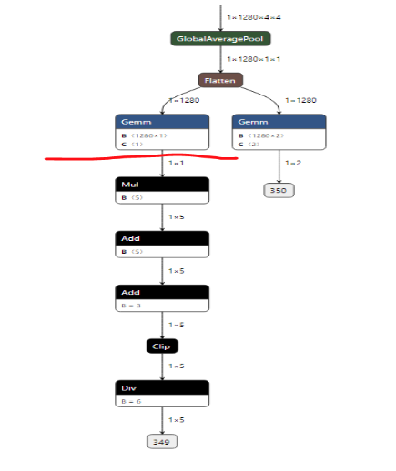

<div align="center">

</div>

# KneronSDK Linux Toolchain User Manual

** 2020 April **

## 0. Overview

KDP toolchain is a software integrating a series of libraries to simulate the operation in the hardware KDP 520. Table 1 shows the list of functions KDP520 supports base on ONNX 1.4.0.

*Table 1. The functions KDP520 NPU supports*

| Layers/Modules   | Functions/Parameters          | Applicable Subset | Spec.                 |
| ---------------- | ----------------------------- | ----------------- | --------------------- |
| Convolution      | Conv                          | Kernel dimension  | 1x1 up to 11x11       |
|                  | Stride                        |                   | 1,2,4                 |
|                  | Pad                           |                   | 0-15                  |
|                  | Depthwise Conv                |                   | Yes                   |
|                  | Deconvolution                 |                   | Use Upsampling + Conv |
| Pooling          | MaxPool                       | 3x3               | stride 1,2,3          |
|                  | MaxPool                       | 2x2               | stride 1,2            |
|                  | MaxPool                       | 2x2               | stride 1,2            |
|                  | AveragePool                   | 3x3               | stride 1,2,3          |
|                  | AveragePool                   | 2x2               | stride 1,2            |
|                  | GlobalAveragePool             |                   | support               |
|                  | GlobalMaxPool                 |                   | support               |
| Activation       | Relu                          |                   | support               |
|                  | Relu                          |                   | support               |
|                  | LeakyRelu                     |                   | support               |
|                  | PRelu                         |                   | support               |
| Other processing | BatchNormalization            |                   | support               |
|                  | Add                           |                   | support               |
|                  | Gemm or Dense/Fully Connected |                   | support               |
|                  | Flatten                       |                   | support               |

## 1.Introduction

### 1.1 Working Flow

To fully utilize Kneron SDK and get detailed information from the running programs, besides the toolchain GUI, Kneron provides a Linux command toolchain containing the following functions:

1. converting deep learning models from different deep learning frameworks (Keras, Tensorflow, Pytorch, Caffe) to ONNX format;
2. conducting fixed pointer analysis on the selected model and image dataset; compiling the related model file to Kneron IP’s corresponding instructions, weight file, and data flow controls;
3. Running ip evaluator, as well as simulator and emulator on the selected model.

<div align="center">

<p><span style="font-weight: bold;">Figure 1.</span> Diagram of working flow</p>
</div>

## 2.Installation

### 2.1 System requirement

Windows 10 home or Ubuntu 16.0.4

### 2.2 Prerequisite

For Windows 10 home, please install [Docker Toolbox](https://download.docker.com/win/stable/DockerToolbox.exe).

For Ubuntu 16.0.4, please follow these instructions (<https://docs.docker.com/install/linux/docker-ce/ubuntu/>) to install.

### 2.3 Docker check

Before using this toolchain, you need to start Docker properly.

For Windows 10 home users, if you successfully installed Docker Toolbox, introduced in Part 2.2, you can search and find the Docker Quickstart Terminal in your computer. Every time you want to use this toolchain, please remember to start the Docker Quickstart Terminal. Figure 2 shows the appearance of a Docker Quickstart Terminal that is started properly. If the terminal does not show this appearance, there was some problem for the installation of Docker.

<div align="center">

<p><span style="font-weight: bold;">Figure 2. </span>Appearance of Docker Quickstart Terminal</p>
</div>

For Ubuntu 16.0.4 users, please refer to this link <https://www.digitalocean.com/community/questions/how-to-check-for-docker-installation> to check whether docker is installed successfully.


## 3.Tutorial Example

During this tutorial, it will use Keras Onet model as an example. For the Window 10 home users, you need to type the commands by Docker Quickstart terminal, and for the Ubuntu 16.0.4 users, you need to type the commands by Ubuntu terminal.

### 3.1 Pull the Docker image

Each time when there is a new version of Linux command toolchain released, you need to pull the latest Docker image.

The command to pull the latest image is:

```bash
docker pull kneron/toolchain:linux_command_toolchain
```

After finishing this command, the Docker image is saved in your local side, and only when you want to update the image to the latest one, you need to connect to the Internet to repeat this command again. Otherwise, you can finish the following parts without the connection to the Internet.

To check whether the Docker image is pulled successfully, type in this command:

```bash
docker image ls
```

If the image is pulled successfully, you will see the image, kneron/toolchain:linux_command_toolchain in the Docker image list.

### 3.2 Start the docker image

Then you can start the docker image you just pulled, and get a docker container to run the toolchain. When you start it, you need to configure a local folder as the one for communicating between your local environment and the container, let’s call it as Interactive Folder Assume the absolute path of the folder you configure is absolute_path_of_your_folder.

And the start command is:

```bash
docker run -it --rm -v absolute_path_of_your_folder:/data1 kneron/toolchain:linux_command_toolchain
```

For example, if the absolute path of the path folder you configure is /home/kneron/Document/test_docker, and then the related command is:

```bash
docker run -it --rm -v /home/kneron/Document/test_docker:/data1 kneron/toolchain:linux_command_toolchain
```

After running the start command, you’ll enter into the docker container. Then, copy the example materials to the Interactive Folder by the following command:

```bash
cp -r /workspace/examples/* /data1/
```


### 3.3 Converter

#### 3.3.1 Keras to ONNX

Since that the Onet model is in keras format, you need to convert it from keras to onnx by the following command:

```bash
python /workspace/onnx-keras/generate_onnx.py -o absolute_path_of_output_model_file  absolute_path_of_input_model_file -O --duplicate-shared-weights
```

For Onet example here, the detailed command is:

```bash
python /workspace/onnx-keras/generate_onnx.py -o /data1/onet-0.417197.onnx /data1/keras/onet-0.417197.hdf5 -O --duplicate-shared-weights
```

There might be some warning log when running this problem, and you can check whether the convert works successfully by checking whether the onnx file is generated.

If there’s customized input shape for the model file, you need to use the following command:

```bash
python /workspace/onnx-keras/generate_onnx.py absolute_path_of_input_model_file -o absolute_path_of_output_model_file -I 1 model_input_width model_input_height num_of_channel
```

Then need to run the command in [`3.3.6 ONNX to ONNX`](#336-onnx-to-onnx).

#### 3.3.2 Tensorflow to ONNX

```bash
python /workspace/scripts/tensorflow2onnx absolute_path_of_input_model_file absolute_path_of_output_onnx_model_file
```

For the provided example model: mnist.pb

```bash
python /workspace/scripts/tensorflow2onnx.py /data1/tensorflow/model/mnist.pb /data1/mnist.pb.onnx
```

Then need to run the command in [`3.3.6 ONNX to ONNX`](#336-onnx-to-onnx).

#### 3.3.3 Pytorch to ONNX

```bash
python /workspace/scripts/pytorch2onnx.py absolute_path_of_input_model_file channel_number model_input_height model_input_width  absolute_path_of_output_model_file
```

For the provided example model: resnet34.pth

```bash
python /workspace/scripts/pytorch2onnx.py /data1/pytorch/models/resnet34.pth 3 224 224 /data1/resnet34.onnx
```

Then need to run the command in [`3.3.6 ONNX to ONNX`](#336-onnx-to-onnx).

#### 3.3.5 Caffe to ONNX

```bash
python /workspace/onnx-caffe/generate_onnx.py -o absolute_path_of_output_onnx_model_file -w absolute_path_of_input_caffe_weight_file -n absolute_path_of_input_caffe_model_file
```

For the provided example model: mobilenetv2.caffemodel

```bash
python /workspace/onnx-caffe/generate_onnx.py -o /data1/mobilenetv2.onnx -w /data1/caffe/models/mobilenetv2.caffemodel -n /data1/caffe/models/mobilenetv2.prototxt
```

Then need to run the command in [`3.3.6 ONNX to ONNX`](#336-onnx-to-onnx).

#### 3.3.6 ONNX to ONNX

After converting models from other frameworks to onnx format, you need to run the following command:

```bash
python /workspace/scripts/onnx2onnx.py absolute_path_of_your_input_onnx_model_file -o absolute_path_of_output_onnx_model_file (-m)
```

Add `–m` only when there is customized layer in your model.

This script will optimize the layer in your model.

#### 3.3.7 Model Editor

##### 3.3.7.1 Introduction

KL520 NPU supports most of the compute extensive OPs, such as Convolution, fully connected/GEMM, in order to speed up the model inference run time. On the other hand, there are some OPs that KL520 NPU cannot support well, such as Softmax or Sigmod. However, these OPs usually are not compute extensive and they are better to execute in CPU. Therefore, Kneron provides a model editor to help user modify the model so that KL520 NPU can run the model more efficiently.

##### 3.3.7.2 General Editor Guideline

Here are some general guideline to edit a model to take full advantage of KL520 NPU MAC efficiency:

**Step 1:** Start from each output nodes of the model, user should trace back to a OP that has significant compute workload, such as Gloabl average pooling, gemm/fully connect, or Convolution. Then user could cut to the ouput of that OP. For example, there is a model such as Figure 4, and it has two output nodes 350 and 349. From output node 349, user can trace back to the GEMM above the red line because the Div, Clip, Add and Mul only have 1x5 dimension, and these OPs are not very heavy computation. Since Mul and Div are not support in NPU, so it is recommend to cut the rest of the OPs and let the model finish at the output of the GEMM (red line). For the other output node 350, since it is the output of a GEMM, there is no need to do any edition.

**Step 2:** If both input nodes and output nodes are channel last, then the model use transpose into channel first, the model editor can swap the input channels and output channels and remove the transpose. 

<div align="center">

<p><span style="font-weight: bold;">Figure 4.</span> Pre-edited model </p>
</div>

##### 3.3.7.3 Feature
There is a script called edit.py in the folder /workspace/scripts, and it is an simple ONNX editor which achieves the following functions:

1. Add nop BN or Conv nodes.
2. Delete specific nodes or inputs.
3. Cut the graph from certain node (Delete all the nodes following the node).
4. Reshape inputs and outputs

#### 3.3.7.4 Usage

```bash
editor.py [-h] [-c CUT_NODE [CUT_NODE ...]]
             [--cut-type CUT_TYPE [CUT_TYPE ...]]
             [-d DELETE_NODE [DELETE_NODE ...]]
             [--delete-input DELETE_INPUT [DELETE_INPUT ...]]
             [-i INPUT_CHANGE [INPUT_CHANGE ...]]
             [-o OUTPUT_CHANGE [OUTPUT_CHANGE ...]]
             [--add-conv ADD_CONV [ADD_CONV ...]]
             [--add-bn ADD_BN [ADD_BN ...]]
             in_file out_file
```

Edit an ONNX model. The processing sequense is 'delete nodes/values' -> 'add nodes' -> 'change shapes'. Cutting cannot be done with other operations together.

```
positional arguments:

in_file   input ONNX FILE
out_file  ouput ONNX FILE

optional arguments:

        -h, --help            show this help message and exit
        -c CUT_NODE [CUT_NODE ...], --cut CUT_NODE [CUT_NODE ...]
        remove nodes from the given nodes(inclusive)

        --cut-type CUT_TYPE [CUT_TYPE ...]
        remove nodes by type from the given nodes(inclusive)

        -d DELETE_NODE [DELETE_NODE ...], --delete DELETE_NODE [DELETE_NODE ...]
        delete nodes by names and only those nodes

        --delete-input DELETE_INPUT [DELETE_INPUT ...]
        delete inputs by names

        -i INPUT_CHANGE [INPUT_CHANGE ...], --input INPUT_CHANGE [INPUT_CHANGE ...]
        change input shape (e.g. -i 'input_0 1 3 224 224')

        -o OUTPUT_CHANGE [OUTPUT_CHANGE ...], --output OUTPUT_CHANGE [OUTPUT_CHANGE ...]
        change output shape (e.g. -o 'input_0 1 3 224 224')

        --add-conv ADD_CONV [ADD_CONV ...]
        add nop conv using specific input

        --add-bn ADD_BN [ADD_BN ...]
        add nop bn using specific input
```

##### 3.3.7.4 Example

1. In the /workspace/scripts/res folder, there is a vdsr model from tensorflow. Convert this model firstly.

```bash
cd /workspace/scripts && ./tf2onnx.sh res/vdsr_41_20layer_1.pb res/tmp.onnx images:0 output:0
```

2. This onnx file seems valid. But, it's channel last for the input and output. It is using Transpose to convert to channel first, affecting the performance. Thus, now use the editor to delete these Transpose and reset the shapes.

```bash
cd /workspace/scripts && python editor.py res/tmp.onnx new.onnx -d Conv2D__6 Conv2D_19__84 -i 'images:0 1 3 41 41' -o 'output:0 1 3 41 41'
```

Now, it has no Transpose and take channel first inputs directly.

#### 3.3.8 Add RGBN to YYNN layer for keras model

```bash
cd /workspace/onnx-keras && python rgba2yynn.py input_hdf5_file output_hdf5_file
```

### 3.4 FpAnalyser, Compiler and IpEvaluator

#### 3.4.1 Fill the input parameters

Before running the programs, you need to configure the input parameters by the input_params.json in Interactive Folder. The initial file of input_params.json is for Keras Onet model. And you can see the detailed explanation for the input parameters in the part FAQ question 1.

#### 3.4.2 Running the program

After filling the related parameters in input_params.json, you can run the programs by the following command:

```bash
# cd /workspace/scripts && ./fpAnalyserCompilerIpevaluator.sh.x thread_number
cd /workspace/scripts && ./fpAnalyserCompilerIpevaluator.sh.x 8
```

After running this program, the folders called compiler and fpAnalyser will be generated in the Interactive tFolder, which store the result of compiler, ipEvaluator and fpAnalyser.

#### 3.4.3 Get the result

In Interactive Folder, you’ll find a folder called fpAnlayer, which contains the preprocessed image txt files; a folder called compiler, which contains the binary files generated by compiler, as well as evaluation result of ipEvaluator, i.e. evaluation_result.txt.

#### 3.4.4 Hardware validation

This step will make sure whether the simulator’s result is the same as the hardware’s.

```bash
cd /workspace/scripts && ./hardware_validate.sh.x
```

### 3.5 Simulator and Emulator

Emulator is just the same as simulator running on a folder of images, but emulator supports multi-process to accelerate the speed.

#### 3.5.1 Fill the input parameters

Fill the simulator and emulator input parameters in the input_params.json in Interactive Folder. Please refer on the FAQ question 1 to fill the related parameters.

#### 3.5.2 Running the programs

For running the simulator:

```bash
cd /workspace/scripts && ./simulator.sh.x
```

And a folder called simulator will be generated in Interactive Folder, which stores the result of the simulator.

For running the emulator:

```bash
cd /workspace/scripts && ./emulator.sh.x
```

And a folder called emulator will be generated in Interactive Folder, which stores the result of the emulator.

#### 3.5.3 Get the result

In Interactive Folder, you’ll find a folder called simulator, which contains the output files of simulator; a folder called emulator, which contains the output folders of simulator.

In each folder, there are three files: one is the input image file, one whose format is “temp***.txt” is the output of the last layer, and the other one is the preprocess image result.


### 3.6 Compiler and Evaluator

This part is similar with part 3.4, and the difference is that this part does not run fpAnalyser, it can be used when your model structure is prepared but hasn’t been trained.

#### 3.6.1 Fill the input parameters

Fill the simulator and emulator input parameters in the input_params.json in Interactive Folder. Please refer on the FAQ question 1 to fill the related parameters.

#### 3.6.2 Running the programs

For running the compiler and ip evaluator:

```bash
cd /workspace/scripts && ./compilerIpevaluator.sh.x
```

And a folder called compiler will be generated in Interactive Folder, which stores the result of the compiler and ipEvaluator.

#### 3.6.3 Get the result

In Interactive Folder, you’ll find a folder called compiler, which contains the output files of the compiler and ipEvaluator , i.e. evaluation_result.txt.

### 3.7 FpAnalyser and Batch-Compile

This part is the instructions for batch-compile, which will generate the binary file requested by firmware.

#### 3.7.1 Fill the input parameters
Fill the simulator and emulator input parameters in the `/data1/batch_compile_input_params.json` in Interactive Folder. Please refer on the FAQ question 7 to fill the related parameters.

And the follow will give two examples for how to configure the batch_compile_input_params.json.

1. tiny_yolo_v3

```json

{
    "input_image_folder": ["/data1/caffe/images"],
    "img_channel": ["RGB"],
    "model_input_width": [224],
    "model_input_height": [224],
    "img_preprocess_method": ["yolo"],
    "input_onnx_file": ["/data1/yolov3-tiny-224.h5.onnx"],
    "keep_aspect_ratio": ["True"],
    "command_addr": "0x30000000",
    "weight_addr": "0x40000000",
    "sram_addr": "0x50000000",
    "dram_addr": "0x60000000",
    "whether_encryption": "No",
    "encryption_key": "0x12345678",
    "model_id_list": [19],
    "model_version_list": [1],
    "add_norm": ["True"],
    "dedicated_output_buffer": "False"
}
```

2. tiny_yolo_v3 and Onet

```json
{
    "input_image_folder": ["/data1/caffe/images", "/data1/keras/n000645"],
    "img_channel": ["RGB", "L"],
    "model_input_width": [224, 48],
    "model_input_height": [224, 48],
    "img_preprocess_method": ["yolo", "kneron"],
    "input_onnx_file": ["/data1/yolov3-tiny-224.h5.onnx", "/data1/onet-0.417197.onnx"],
    "keep_aspect_ratio": ["True", "True"],
    "command_addr": "0x30000000",
    "weight_addr": "0x40000000",
    "sram_addr": "0x50000000",
    "dram_addr": "0x60000000",
    "whether_encryption": "No",
    "encryption_key": "0x12345678",
    "model_id_list": [19, 20],
    "model_version_list": [1, 1],
    "add_norm": ["True", "False"],
    "dedicated_output_buffer": "False"
}
```

#### 3.7.2 Running the programs

For running the compiler and ip evaluator:

```bash
# cd /workspace/scripts && ./fpAnalyserBatchCompile.sh.x thread_number
cd /workspace/scripts && ./fpAnalyserBatchCompile.sh.x 8
```

And a folder called batch_compile will be generated in Interactive Folder, which stores the result of the fpAnalyer and batch-compile.

#### 3.7.3 Get the result

In Interactive Folder, you’ll find a folder called batch_compile, which contains the output files of the fpAnalyer and batch_compile. If you have questions for the meaning of the output files, please refer to the FAQ question 8. 

#### 3.7.4 Reference Models

##### 3.7.4.1 Hardware Parameters

KL520, Mozart, 512KB SRAM, 1GB/s

##### 3.7.4.2 Performace Table

| Model                | Size    | FPS  | Time(ms) |
| -------------------- | ------- | ---- | -------- |
| Inceptionv3          | 224x224 | 6.4  | 156      |
| Inception v4         | 299x299 | 0.48 | 2044     |
| Mobilenet V1         | 224x224 | 61.3 | 16.3     |
| Mobilenet V2         | 224x224 | 63.2 | 15.8     |
| Mobilenet v1 ssd     | 300x300 | 18.2 | 54.9     |
| Mobilenet v2 ssdlite | 300x300 | 28.3 | 35.3     |
| Resnet34 v1.5        | 224x224 | 13.1 | 76.2     |
| Resnet50 v1.5        | 224x224 | 7.3  | 136      |
| Inception resnet v2  | 299x299 | 1.3  | 717      |
| openpose             | 256x256 | 0.61 | 1637     |
| SRCNN                | 300x300 | 9.9  | 101      |
| Tiny yolo v2         | 416x416 | 17.6 | 56.7     |
| Tiny yolo v3         | 320x320 | 23.5 | 42.4     |
| Yolo v3              | 416x416 | 2.2  | 442      |
| Yolo v3              | 416x416 | 1.5  | 647      |


### 3.8 Draw Yolo result on images

The toolchain also provides the function of drawing final result on images for yolo model, i.e. drawing the box and class name.

#### 3.8.1 Steps

**Step 1:** Follow the part 3.5 Simulator and Emulator, it will generate the result of emulator for multiply images, and the result folder path is “/data1/emulator”. In this folder,  the original image, the preprocess image txt file and the final output of the model are classified in different folder. Besides, there’ll be a file called “detection_result.txt”, which summaries all the detection results of the dataset.

**Step 2:** Fill the anchor and class name information. Go to the folder path `/workspace/scripts/utils/yolo/kerasyolo3/model_data`, fill the anchor.txt and classes.txt based on the information of your model.

**Step 3:** Run the scripts to draw the yolo result.

```bash
cd /workspace/scripts/utils/yolo && python convert_sim_result_yolo.py --input_size your_model_input_size --output_num the_num_of_your_models_output_node --keep_aspect_ratio whether_keep_aspect_ratio --score your_score

# input_size is the height/width of the model’s input, e.g.  if the input onnx model’s input is (3,416,416), the input_size is 416;
# output_num is the number of the model’s output nodes;
# whether_keep_aspect_ratio should be the same when you configured in part 3.7.3;
# your_score is the score threshold you set for the detection box
```

**Step 4:** After step 3, the drawing result will be saved in the subfolders of “/data1/emulator”, with the format “imgname_thresh_xxx.png”, xxx means the threshold for the box score, which means only the boxes with score higher than this threshold will be drawn in this image.

### 3.9 Other utilities

#### 3.9.1 Convert bin file to png

```bash
cd /workspace/scripts && python bintoPng.py -i input_rgb565_file_path –o output_png_file_path –he rgb565_height –w rgb565_width -f bin_format
```

#### 3.9.2 Post process

```bash
cd /workspace/scripts && python post_process.py -i emulator_result_folder, -m model_type
```

## FAQ

### 1. How to configure the input_params.json?

By following the above instructions, the input_params.json will be saved in Interactive Folder.
Please do not change the parameters’ names.

The parameters in input_params.json are:

1. input_image_folder  
The absolute path of input image folder for fpAnalyser.  
2. img_channel  
Options: L, RGB  
The channel information after the input image is preprocessed. L means single channel. Input for fpAnalyer.  
3. model_input_width  
The width of the model input size.Input for fpAnalyer.  
4. model_input_height  
The height of the model input size.  
5. img_preprocess_method  
Options: kneron, tensorflow, yolo, caffe, pytorch  
The image preprocess methods, input for fpAnlayer, and the related formats are following:  
“kneron”: RGB/256 - 0.5,  
“tensorflow”: RGB/127.5 - 1.0,  
“yolo”: RGB/255.0  
“pytorch”: (RGB/255. -[0.485, 0.456, 0.406]) / [0.229, 0.224, 0.225]  
“caffe”(BGR format) BGR  - [103.939, 116.779, 123.68]  
“customized”: please refer to FAQ question 9  
6. input_onnx_file  
The absolute path of the onnx file, which works as the input file for fpAnalyser.  
7. keep_aspect_ratio  
Options: True, False  
Indicates whether or not to keep the aspect ratio.  
8. command_addr  
Address for command, input for compiler.  
9. weight_addr  
Address for weight, input for compiler.  
10. sram_addr  
Address for sram, input for compiler.  
11. dram_addr  
Address for dram, input for compiler.  
12. whether_encryption  
Option: Yes, No  
Whether add encryption on the bin files generated by compiler, input for compiler.  
13. encryption_key  
Encryption key for bin files, input for compiler.  
14. simulator_img_file  
Input for simulator.  
The absolute path of the image you want to inferenced by simulator.  
15. emulator_img_folder  
The absolute path of the image folder you want to inferenced by emulator.  
16. cmd_bin  
The absolute path of command binary file, which is the input file for simulator or emulator.  
17. weight_bin  
The absolute path of weight binary file, which is the input file for simulator or emulator.  
18. setup_bin  
The absolute path of setup binary file, which is the input file for simulator or emulator.  
19. whether_npu_preprocess  
The option for whether simulator or emulator using the same image processing as the npu uses.  
If false, the parameters (20) - (25) will not be utilized.  
Parameters (20) - (25) is for npu image preprocessing.  
20. raw_img_fmt  
The input image format for simulator and emulator  
Options: IMG, RGB565, NIR888  
IMG: jpg/png/jpeg/bmp image files  
RGB565: binary file with rgb565 format;  
NIR888: binary file with nir888 format.  
21. radix  
The radix information for the npu image process.  
The formula for radix is 7 – ceil(log2 (abs_max))  
For example, if the image processing method we utilize is “kneron”, which is introduced in the parameter (5). So the related image processing formula is “kneron”: RGB/256 - 0.5, and the processed value range will be (-0.5, 0.5), and then  
abs_max = max(abs(-0.5), abs(0.5)) = 0.5  
Radix = 7 – ceil(log2(abs_max)) = 7 - (-1) = 8  
22. pad_mode  
This is the option for the mode of adding paddings, and it will be utilized only when (7) keep_aspect_ratio is True.  
And it has two options: 0 and 1.  
0 – If the original width is too small, the padding will be added at both right and left sides equally; if the original height is too small, the padding will be added at both up and down sides equally.  
1 – If the original width is too small, the padding will be added at the right side only, if the original height is too small, the padding will be only added at the down side.  
23. rotate  
It has three options:  
0 – no rotating operation  
1 – rotate 90 degrees in clockwise direction  
2 – rotate 90 degrees in counter-clockwise direction  
24. pCrop  
The parameters for cropping image.  
And it has four sub parameters.  
-bCropFirstly, whether cropping the image firstly, if false, the following parameters won’t be utilized, and there won’t be any cropping operations.  
-crop_x, cropy, the left-up cropping point coordinate.  
-crop_w, the width of the cropped image.  
-crop_h,  the height of the cropped image.  
25. imgSize:  
-width: input image width  
-height: input image height  
26. add_norm  
Option: “True” / “False”  
This option is whether add an extra conv layer at the beginning of the model, it will help when dealing with the image preprocess. For example, when you choose “yolo” as the image preprocess method, the preprocess’s output range would be 0~1, in this case, all the computation is finished in CPU, which is time-consuming; when you choose add_norm as “True”, the image preprocess will be split into two parts: firstly, the CPU will finish the part of the preprocess, and the internal output range is –0.5 ~ 0.5, and then the NPU (the extra norm layer) will finish the remaining adding computation (+0.5),  and the final will be 0~1.


### 2. Fails when implement models with SSD structure.

Currently, our NPU does not support SSD like network since it has Reshape and Concat operations in the end of the model, but we do offer a work around solution to this situation.

The reason we do not support Reshape and Concat operation is that we do offer Reshape operation capability, However, we only support regular shape transportation. Which means you could flatten your data or extract some channels form the feature map. However, NPU does not expect complex transportation. For example, in Figure 13, you could notice there is a 1x12x4x5 feature map reshapes to 1x40x6.

For Concat operation, the NPU also supports channel-based feature map concatenation. However, it does not support Concate operation based on another axis. For example, in Figure 14, The concatenation on based on axis 1 and the following concatenation is based on axis 2.

The workaround we will offer is that deleting these Reshape and Concat operations and enable make the model to a multiple outputs model since they are in the end of the models and they do not change the output feature map data. So converted model should look like this as in Figure 15.


<div align="center">

<p><span style="font-weight: bold;">Figure 13.</span>  Invalid Reshape operation  </p>
</div>
<div align="center">

<p><span style="font-weight: bold;">Figure 14.</span>  Invalid Concat operation </p>
</div>
<div align="center">

<p><span style="font-weight: bold;">Figure 15.</span>  Valid SSD operation </p>
</div>

### 3. Fails in the step of FpAnalyser

When it shows the log “mystery”, it means there are some customized layers in the model you input, which are not support now.

When it shows the log “start datapath analysis”, you need to check whether you input the proper image pre-process parameters.


### 4. Other unsupported models

This version of SDK doesn’t support the models in the following situations:
1. Have customized layers.

### 5. What’s the meaning of simulator’s output?

* estimate FPS float => average Frame Per Second
* total time => total time duration for single image inference on NPU
* MAC idle time => time duration when NPU MAC engine is waiting for weight loading or data loading
* MAC running time => time duration when NPU MAC engine is running
* average DRAM bandwidth => average DRAM bandwidth used by NPU to complete inference
* total theoretical convolution time => theoretically minimum total run time of the model when MAC efficiency is 100%
* MAC efficiency to total time => time ratio of the theoretical convolution time to the total time

### 6. How to configure the batch_compile_input_params.json?

By following the above instructions, the batch_compile_input_params.json will be saved in Interactive Folder. Please do not change the parameters’ names. The parameters in batch_compile_input_params.json are:

1. input_image_folder  
The absolute path of input image folder for fpAnalyser. Since that batch-compile can compile more than one models together, the order of the input_imgae_folder is related to the order of input_onnx_file.  
2. img_channel  
Options: L, RGB  
The channel information after the input image is preprocessed. L means single channel. Input for fpAnalyer. Same as (1), the order of the img_channel is related to the order of input_onnx_file.  
3. model_input_width  
The width of the model input size.Input for fpAnalyer. Same as (1), the order of the model_input_width is related to the order of input_onnx_file.  
4. model_input_height  
The height of the model input size. Same as (1), the order of the model_input_height is related to the order of input_onnx_file.  
5. img_preprocess_method  
Options: kneron, tensorflow, yolo, caffe, pytorch. Same as (1), the order of the img_preprocess_method is related to the order of input_onnx_file.  
The image preprocess methods, input for fpAnlayer, and the related formats are following:  
“kneron”: RGB/256 - 0.5,  
“tensorflow”: RGB/127.5 - 1.0,  
“yolo”: RGB/255.0  
“pytorch”: (RGB/255. -[0.485, 0.456, 0.406]) / [0.229, 0.224, 0.225]  
“caffe”(BGR format) BGR  - [103.939, 116.779, 123.68]  
6. input_onnx_file  
The absolute path of the onnx file, which works as the input file for fpAnalyser. Since that the batch-compile can compile more than one models at a time. The order of the model in the array of input_onnx_file decides the model binary’s order in all_models.bin  
7. keep_aspect_ratio  
Options: True, False  
Indicates whether or not to keep the aspect ratio.  
8. command_addr  
Address for command, input for compiler.  
9. weight_addr  
Address for weight, input for compiler.  
10. sram_addr  
Address for sram, input for compiler.  
11. dram_addr  
Address for dram, input for compiler.  
12. whether_encryption  
Option: Yes, No  
Whether add encryption on the bin files generated by compiler, input for compiler.  
13. encryption_key  
Encryption key for bin files, input for compiler.  
14. model_id_list  
The list of model id information  
15. model_version_list  
The list of model version information.  
16. add_norm_list  
The list of whether add norm layer on each model.  
17. dedicated_output_buffer  
Default: false  
If the option is chosen as true, the output nodes’ results would be saved together, which will then be good for multiple output node models or parallel processing.


### 7. What’s the meaning of the output files of batch-compile?

The result of 3.7 FpAnalyser and Batch-Compile is generated at a folder called batch_compile at Interactive Folder, and it has two sub-folders called fpAnalyser and compiler.

In fpAnalyser subfolder, it has the folders with name format as input_img_txt_X, which contains the .txt files after image preprocessing. The index X is the related to the order of model file in FAQ question 7 (6), which means the folder input_img_txt_X is number X model’s preprocess image text files.

In compile subfolder, it will have the following files: all_model.bin, fw_info.bin, temp_X_ioinfo.csv. The X is still the order of the models.

-all_model.bin and fw_info.bin is for firmware to use.

-temp_X_ioinfo.csv contains the information that cpu node and output node.

If you find the cpu node in temp_X_ioinfo.csv, whose format is “c,\**,**”, you need to implement and register this function in SDK.


#### 8. How to use customized methods for image preprocess? 

1. Configure the input_params.json, and fill the value of “img_preprocess_method” as “customized”;
2. edit the file /workspace/scripts/img_preprocess.py, search for the text “#this is the customized part” and add your customized image preprocess method there.