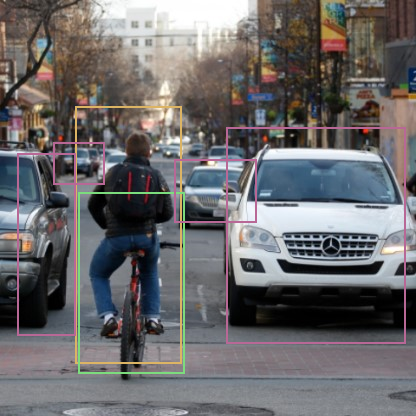
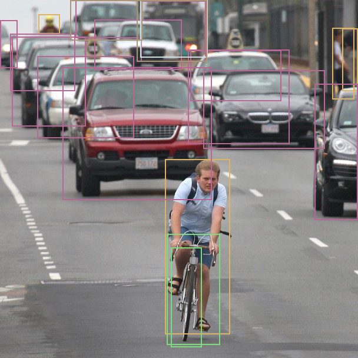

# Getting Started

**Note**: We built and run the examples below under OS Ubuntu 18.04.5 LTS with cmake version 3.10.2.

**Note**: Refer to [Kneron PLUS Introduction](./introduction/introduction.md) for feature details

**Note**: For `Python` usages, please refer ${PLUS_FOLDER}/python/README.md

---

## 1. Introduction

In this document, we will introduce **Kneron PLUS** (*Platform Library Unified Software*) framework to demonstrate the usage of Kneron AI device from host software. When referring to a complete AI application development, actually three parts are involved:

- **model development**
- **software development**
- **firmware development**

This **Getting Started** document only focuses on host software usage with the AI device to perform following functionality.

- How to upgrade the AI device to KDP2 firmware loader.
- How to build the software package
- How to run the APP Yolo inference example.

For **model development**, please refer the [Toolchain Docker](../toolchain/manual.md) part.

For **firmware development**, please refer the documents in [Customized API](./customized_api/introduction.md).

---

## 2. Upgrade AI Device to KDP2 Firmware

**Note**: For the Windows users, please refer [Install Dependency](./introduction/install_dependency.md#21-kneron-ai-device-driver) for the installation of the driver.

**Note**: For details, please refer [Upgrade AI Device to KDP2 Firmware](./introduction/upgrade_ai_device_to_kdp2.md).

---

Before running PLUS examples, users need to make the AI device running with the KDP2 firmware.

Download the *KneronDFUT_ubuntu.zip* into Ubuntu in from https://www.kneron.com/tw/support/developers/. It is located at **Kneron PLUS** section.

```bash
$ unzip KneronDFUT_ubuntu.zip
$ cd Kneron_DFUT/bin/
```

Use Command Line

```bash
$ sudo ./KneronDFUT --help
```

```bash
[Display help message]
    --help                : [no argument]         help message

[Scan and list all information]
    --list                : [no argument]         list all dongles information

[Update dongles to usb boot] (Only works for KL520)
    --kl520-usb-boot      : [no argument]         choose update to Usb Boot
    --port                : [argument required]   port id set ("all" or specified multiple port ids "13,537")

[Update dongles to flash boot] (Only works for KL520)
    --kl520-flash-boot    : [no argument]         choose update to Flash Boot
    --port                : [argument required]   port id set ("all" or specified multiple port ids "13,537")
    --scpu                : [argument required]   self pointed scpu firmware file path (.bin)
    --ncpu                : [argument required]   self pointed ncpu firmware file path (.bin)

[Update firmware file to flash memory in dongles (Only works for KL720)
    --kl720-update        : [no argument]         choose write firmware to flash memory
    --port                : [argument required]   port id set ("all" or specified multiple port ids "13,537")
    --scpu                : [argument required]   self pointed scpu firmware file path (.bin)
    --ncpu                : [argument required]   self pointed ncpu firmware file path (.bin)

[Update model file to flash memory in dongles
    --model-to-flash      : [argument required]   self pointed model file path (.nef)
    --type                : [argument required]   type of device ("KL520" or "KL720")
    --port                : [argument required]   port id set ("all" or specified multiple port ids "13,537")

[Enable Graphic User Interface]
    --gui                 : [no argument]         display GUI

[Get Current Kneron DFUT Version]
    --version             : [no argument]         display the version of Kneron DFUT
```

### 2.1 KL520

1. Use GUI to Update AI Device

    ```bash
    $ sudo ./KneronDFUT
    ```

    * Select the AI device to be update to KDP2 firmware

    * Push **Run** button
      \(**Update to USB Boot** should be checked by default\)

    

2. Use Command Line to Update AI Device

    ```bash
    $ sudo ./KneronDFUT --list
    ```

    ```bash
    ===========================================
    Index:          1
    Port Id:        133
    Kn Number:      0x270A265C
    Device Type:    KL520
    FW Type:        KDP
    Usb Speed:      High-Speed
    Connectable:    true
    ===========================================
    ```

    ```bash
    $ sudo ./KneronDFUT --kl520-usb-boot --port 133
    ```

    ```bash
    Start Update Device with Port Id 133 to USB Boot

    ==== Update of Device with Port Id: 133 Succeeded ====
    ```

### 2.2 KL720

1. Use GUI to Update AI Device

    ```bash
    $ sudo ./KneronDFUT
    ```

    * Select **KL720** Tab.

    * Select the KL720 dongles to be update to KDP2 frimware.

    * Select **Update Firmware to Flash**

    * Manually choose **SCPU firmware file** and **NCPU firmware file**.
    	* The firmware files can be found in **${PLUS_FOLDER}/res/firmware/KL720/**

    * Push **Run** button.

    


2. Use Command Line to Update AI Device

    ```bash
    $ sudo ./KneronDFUT --list
    ```

    ```bash
    ===========================================
    Index:          1
    Port Id:        262
    Kn Number:      0x2004142C
    Device Type:    KL720
    FW Type:        KDP
    Usb Speed:      Super-Speed
    Connectable:    true
    ===========================================
    ```

    ```bash
    $ sudo ./KneronDFUT --kl720-update --port 262 --scpu ${SCPU_FILE_PATH} --ncpu ${NCPU_FILE_PATH}
    ```

    ```bash
    Start Update Firmware to Device with Port Id 262

    ==== Update Firmware to Device with Port Id: 262 Succeeded ====
    ```

---

## 3. Build PLUS

### 3.1 Ubuntu

1. Before building code, some build tools and packages must be set up for the first time. Please refer [Install Depedency](./introduction/install_dependency.md#1-ubuntu-1804--raspberry-pi-os---buster)

2. Download the latest **kneron_plus_vXXX.zip** into Ubuntu from <https://www.kneron.com/tw/support/developers/>. It is located at **Kneron PLUS** section.

3. Decompress the **kneron_plus_vXXX.zip**.

    ```bash
    $ unzip kneron_plus_vX.X.X.zip
    ```

4. Build code.

    ```bash
    $ cd kneron_plus/
    $ mkdir build
    $ cd build/
    $ cmake ..
    $ make -j
    ```
    **Note**: if you also want to build OpenCV examples at this moment,
    please adjust cmake command as following
    ```bash
    $ cmake .. -D WITH_OPENCV=ON
    ```

Once build is done, the **libkplus.so** and example executables will be in **build/bin/**

Check if PLUS examples are built successfully.

```bash
$ ls bin/

    kl520_demo_app_yolo_inference
    kl520_demo_app_yolo_inference_multithread
    kl520_demo_customize_inf_multiple_models
    kl520_demo_customize_inf_single_model
    kl520_demo_generic_inference
    ...
```

### 3.2 Windows

1. Before building code, some build tools and packages must be set up for the first time. Please refer [Install Depedency](./introduction/install_dependency.md#2-windows-10)

2. Download the latest **kneron_plus_vXXX.zip** into Windows from <https://www.kneron.com/tw/support/developers/>. It is located at **Kneron PLUS** section.

3. Decompress the **kneron_plus_vXXX.zip**.

4. Build PLUS in **MSYS2 MinGW 64-bit**

    ```bash
    $ cd ${PLUS_FOLDER_PATH}
    $ mkdir build
    $ cd build
    $ cmake .. -G "MSYS Makefiles"
    $ make -j
    ```
    **Note**: if you also want to build OpenCV examples at this moment,
    please adjust cmake command as following
    ```bash
    $ cmake .. -G "MSYS Makefiles" -D WITH_OPENCV=ON
    ```

    **Note**: Some examples may cause warnings during cmake process due to the length of the paths. You can rename these examples to shorter names to avoid these warnings.

Once build is done, the **libkplus.so** and example executables will be in **build/bin/**

Check if PLUS examples are built successfully in **MSYS2 MinGW 64-bit**.

```bash
$ ls bin/

    kl520_demo_app_yolo_inference
    kl520_demo_app_yolo_inference_multithread
    kl520_demo_customize_inf_multiple_models
    kl520_demo_customize_inf_single_model
    kl520_demo_generic_inference
    ...
```

---

## 4. Run App Yolo Inference

**Note**: If you are using Windows, please run example in **MSYS2 MinGW 64-bit**.

### 4.1 KL520

```bash
$ sudo ./kl520_demo_app_yolo_inference
```

```bash
connect device ... OK
upload firmware ... OK
upload model ... OK
read image ... OK

starting inference loop 100 times:
.......................................
detectable class count : 80
box count : 5
Box 0 (x1, y1, x2, y2, score, class) = 45.0, 57.0, 93.0, 196.0, 0.965018, 0
Box 1 (x1, y1, x2, y2, score, class) = 43.0, 95.0, 100.0, 211.0, 0.465116, 1
Box 2 (x1, y1, x2, y2, score, class) = 122.0, 68.0, 218.0, 185.0, 0.997959, 2
Box 3 (x1, y1, x2, y2, score, class) = 87.0, 84.0, 131.0, 118.0, 0.499075, 2
Box 4 (x1, y1, x2, y2, score, class) = 28.0, 77.0, 55.0, 100.0, 0.367952, 2

output bounding boxes on 'output_bike_cars_street_224x224.bmp'

```

Besides output results in the screen console, it also draws detected objects in a new-created **output_bike_cars_street_224x224.bmp**.



### 4.2 KL720

```bash
sudo ./kl720_demo_app_yolo_inference
```

```bash
connect device ... OK
upload model ... OK
read image ... OK

starting inference loop 100 times:
.......................................

detectable class count : 80
box count : 21
Box 0 (x1, y1, x2, y2, score, class) = 280.2, 269.8, 390.5, 566.2, 0.841003, 0
Box 1 (x1, y1, x2, y2, score, class) = 564.3, 46.5, 601.3, 167.2, 0.616089, 0
Box 2 (x1, y1, x2, y2, score, class) = 65.5, 23.8, 101.6, 57.0, 0.605835, 0
Box 3 (x1, y1, x2, y2, score, class) = 581.4, 47.5, 608.0, 153.9, 0.427032, 0
Box 4 (x1, y1, x2, y2, score, class) = 283.1, 396.1, 373.4, 584.2, 0.616180, 1
Box 5 (x1, y1, x2, y2, score, class) = 290.7, 419.9, 342.9, 588.0, 0.159668, 1
Box 6 (x1, y1, x2, y2, score, class) = 345.8, 118.8, 551.0, 251.8, 0.824463, 2
Box 7 (x1, y1, x2, y2, score, class) = 106.4, 113.0, 359.1, 338.2, 0.810455, 2
Box 8 (x1, y1, x2, y2, score, class) = 534.8, 141.6, 607.0, 372.4, 0.794922, 2
Box 9 (x1, y1, x2, y2, score, class) = 63.6, 94.0, 227.0, 233.7, 0.732697, 2
Box 10 (x1, y1, x2, y2, score, class) = 160.6, 32.3, 308.8, 117.8, 0.700256, 2
Box 11 (x1, y1, x2, y2, score, class) = 323.0, 84.5, 477.8, 171.0, 0.676361, 2
Box 12 (x1, y1, x2, y2, score, class) = 17.1, 57.0, 127.3, 153.9, 0.524628, 2
Box 13 (x1, y1, x2, y2, score, class) = 20.9, 61.8, 145.3, 213.8, 0.508331, 2
Box 14 (x1, y1, x2, y2, score, class) = 0.0, 33.2, 29.4, 114.9, 0.452179, 2
Box 15 (x1, y1, x2, y2, score, class) = 128.2, 0.0, 241.3, 63.6, 0.415009, 2
Box 16 (x1, y1, x2, y2, score, class) = 239.4, 0.9, 349.6, 103.5, 0.257294, 2
Box 17 (x1, y1, x2, y2, score, class) = 319.2, 83.6, 491.1, 243.2, 0.225555, 2
Box 18 (x1, y1, x2, y2, score, class) = 238.4, 0.0, 352.5, 96.9, 0.241699, 5
Box 19 (x1, y1, x2, y2, score, class) = 119.7, 0.0, 241.3, 67.4, 0.253082, 7
Box 20 (x1, y1, x2, y2, score, class) = 232.8, 0.0, 351.5, 103.5, 0.234406, 7

output bounding boxes on 'output_one_bike_many_cars_608x608.bmp'
```

Besides output results in the screen console, it also draws detected objects in a new-created **output_one_bike_many_cars_608x608.bmp**.


