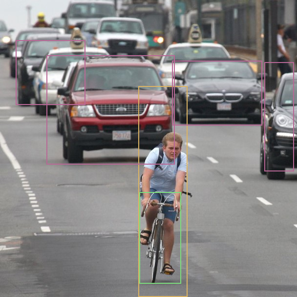
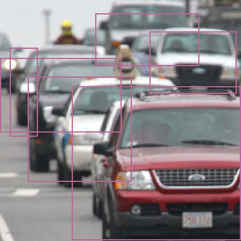

# Run Inference Examples

The provided examples are designed to show how to use KP APIs and present Kneron Device features. Error handling, wording and application layer features are not covered. They are open for more creatives.

**Note**: If you are using Windows, please execute all the instruction below in MSYS2 MinGW 64-bit.

**Note**: In the inference related examples, we are using KL520 for most demo. If you wish to use KL720, just change the prefix of the example name from kl520 to kl720.

**Note**: Few examples will auto connect multiple devices to run inference. If you put hybrid types of dongles on host, the inference may fail.

**Note**: If you modify code to change different test image file. Input image aspect ratio is suggested to be aligned to model input aspect ratio.

**Note**: Reference to [Yolo Object Name Mapping](./yolo_object_name_mapping.md) for the detection result classes of YOLO examples.

---

## 1. Build PLUS

1. Download the latest **kneron_plus_vXXX.zip** into Ubuntu from <https://www.kneron.com/tw/support/developers/>. It is located at **Kneron PLUS** section.

2. Decompress the **kneron_plus_vXXX.zip**

    ```bash
    $ unzip kneron_plus_vX.X.X.zip
    ```

3. Build code

    If you are using Ubuntu:

    ```bash
    $ cd kneron_plus/
    $ mkdir build
    $ cd build
    $ cmake ..
    $ make -j
    ```
    **Note**: if you also want to build OpenCV examples at this moment,
    please adjust cmake command as following
    ```bash
    $ cmake .. -D WITH_OPENCV=ON
    ```

    If you are using MSYS2 MinGW 64-bit in Windows:

    ```bash
    $ cd kneron_plus/
    $ mkdir build
    $ cd build
    $ cmake .. -G "MSYS Makefiles"
    $ make -j
    ```
    **Note**: if you also want to build OpenCV examples at this moment,
    please adjust cmake command as following
    ```bash
    $ cmake .. -G "MSYS Makefiles" -D WITH_OPENCV=ON
    ```

    **Note**: Some examples may cause warnings during cmake process due to the length of the paths. You can rename these examples to shorter names to avoid these warnings.

    - Once build is done, the **libkplus.so** will be in **build/src/**

    - Example executables will be in **build/bin/**

4. Check if PLUS examples are built successfully.

    ```bash
    $ ls bin/

        kl520_demo_app_yolo_inference
        kl520_demo_app_yolo_inference_multithread
        kl520_demo_customize_inf_multiple_models
        kl520_demo_customize_inf_single_model
        kl520_demo_generic_inference
        ...
    ```

---

## 2. Scan Device Example

Note: This example is to show the usage of `kp_scan_devices()`.

While one or multiple AI devices are plugged into the host, they can be scanned to get some basic device information.

```bash
$ sudo ./scan_devices
```

```bash
scanning kneron devices ...
number of Kneron devices found: 2

listing devices infomation as follows:

[0] scan_index: '0'
[0] port ID: '517'
[0] product_id: '0x100' (KL520)
[0] USB link speed: 'High-Speed'
[0] USB port path: '1-1-4'
[0] kn_number: '0x270A265C'
[0] Connectable: 'True'
[0] Firmware: 'KDP'

[1] scan_index: '1'
[1] port ID: '38'
[1] product_id: '0x100' (KL520)
[1] USB link speed: 'High-Speed'
[1] USB port path: '1-1-5'
[1] kn_number: '0x63252C53'
[1] Connectable: 'True'
[1] Firmware: 'KDP2 Loader'
```

Above shows that it founds two KL520 devices, a brief descript listed below.

- **scan_index** : An index number represents the device in the scanned order, can be used by KP API to establish USB connection.
- **port ID** : An unique number represents the device on the certain usb port, can be used by KP API to establish USB connection.
- **product_id** : The product ID.
- **USB link speed** : USB link speed, High-Speed is speed for USB2.0. Super-Speed is speed for USB3.0.
- **USB port path** : This means the physical USB port path on the host.
- **kn_number** : Kneron's serial number for the device.
- **Connectable** : It tells if this device is connectable; one device can only be connected by one program at the same time.
- **Firmware** : This shows which firmware the AI device is using, KDP or KDP2 Loader.

---

## 3. Connect Device Example

This example is to show the usage of `kp_device_group_t`, `kp_connect_device()` and different filter ways of finding target devices to connect. Furthermore, the `kp_device_group_t` is a working unit to be operated in **Kneron PLUS API**.

Notice that it is not allowed to connect different target platform devices into a deivce group.

```bash
sudo ./connect_devices --help
```

```bash
connect_devices example

  show different filter ways of finding target devices to connect
  Notice that it is not allowed to connect different target platform devices into a deivce group

Arguments:
-help, h   : print help message
-target, t : [by target platform] = (KL520|KL720)
-sidx, s   : [by scan index set] = (specified scan index set, can also be "0,1,2" for multiple devices)
-port, p   : [by port id set] = (specified port id set, can also be "13,537" for multiple devices)
-kn, k     : [by KN number set] = (specified KN number set, scan also be "0x1111aaaa, 0x2222bbbb" for multiple devices)
```

- **target**: using the target platform (KL520 or KL720) to connect.
- **sidx**: using the specified scan index set to connect.
- **port**: using the port id set to connect.
- **kn**: using the KN number set to connect.

---

## 4. APP Inference Example

Note: This example is to show the usage of `kp_app_yolo_inference_send()` and `kp_app_yolo_inference_receive()`.

APP Inference Examples are using the **APP Inference APIs**, which provide some decent functions for specific applications with specified NEF models and it is designed to be used in a easy way.

The **kl520_demo_app_yolo_inference** example utilizes the **APP Inference API - Yolo** and the **Tiny Yolo V3 model** to perform object detection.

This example takes **res/models/KL520/tiny_yolo_v3/models_520.nef** as the inference model, **res/images/bike_cars_street_224x224.bmp** as the input image in BMP format and prints inference results.

```bash
$ sudo ./kl520_demo_app_yolo_inference
```

```bash
connect device ... OK
upload firmware ... OK
upload model ... OK
read image ... OK

starting inference loop 100 times:
.....................................

detectable class count : 80
box count : 5
Box 0 (x1, y1, x2, y2, score, class) = 45.0, 57.0, 93.0, 196.0, 0.965018, 0
Box 1 (x1, y1, x2, y2, score, class) = 43.0, 95.0, 100.0, 211.0, 0.465116, 1
Box 2 (x1, y1, x2, y2, score, class) = 122.0, 68.0, 218.0, 185.0, 0.997959, 2
Box 3 (x1, y1, x2, y2, score, class) = 87.0, 84.0, 131.0, 118.0, 0.499075, 2
Box 4 (x1, y1, x2, y2, score, class) = 28.0, 77.0, 55.0, 100.0, 0.367952, 2

output bounding boxes on 'output_bike_cars_street_224x224.bmp'
```

Besides output results in the screen console, it also draws detected objects in a new-created **output_bike_cars_street_224x224.bmp**.


The key features of APP inference are listed below:

- Specified model NEF.
- Normally post-process is done in SoC.

---

## 5. Generic Inference Example

Following examples show the usage of `kp_generic_raw_inference_send()` and `kp_generic_raw_inference_receive()`.

Generic inference examples are using the **Generic Inference API**, which is intended for advanced users who are interested in developing their models and implement corresponding post-processing code.

**Generic Inference API** allows users to directly run a model with or without Kneron pre-processing and obtain the raw output from the model, without any developments of Kneron AI device's firmware. Please refer [5.1 Generic Inference With Raw Output](#51-generic-inference-with-raw-output) and [5.2 Generic Inference Without Kneron Pre-Processing On Device](#52-generic-inference-without-kneron-pre-processing-on-device) for the demonstration of the usage.

However, **Generic Inference API** can only provide the raw output from the model without post-processing. If you wish to get the result with post-processing, you may implement the corresponding post-processing in Software (Please refer [5.3 Generic Inference With Post-Processing](#53-generic-inference-with-post-processing) for the demonstration).

In **Generic Inference API**, you may customized what to do in the pre-processing. There are few items are provided:

1. Image Resize
    - You can choose to do or not to do the image resize by setting `resize_mode` in `kp_generic_raw_image_header_t`.
2. Image Padding
    - You can choose to do *Symmetric Padding* (Top, Bottom, Left, Right), *Corner Padding* (Right, Bottom), and not to do the image padding by setting `padding_mode` in `kp_generic_raw_image_header_t`.
3. Image Cropping
    - You can choose to do or not to do the image cropping by setting `crop_count` and `inf_crop` in `kp_generic_raw_image_header_t`.
    - Please refer [5.4 Generic Inference With Cropping Image in Pre-Process](#54-generic-inference-with-cropping-image-in-pre-process) for the demonstration.
4. Image Format
    - You have to provide the format of the input image correctly by setting `image_format` in `kp_generic_raw_image_header_t`.
    - In the pre-process, the image will be convert to the format *RGBA8888*.
5. Data Normalization
    - You can choose to do *Kneron Normalization*, *Tensor Flow Normalization*, *Yolo Normalization*, or other *Customized Normalization* by setting `normalize_mode` in `kp_generic_raw_image_header_t`.

Furthermore, if you wish to execute the post-processing on Kneron AI devices (or implement different pre-processing on devices), you should use **Customized Inference API** instead of **Generic Inference API**, and need to develope the code into Kneron AI device's firmware. Please refer [6. Customized Inference Example](#6-customized-inference-example) for more information.

**Generic Inference API** provide following functions to retrieve specific output node data (More information please reference *API Reference/Inference API*):

| Retrieve Node Function                               | Description                                                                              |
| ---------------------------------------------------- | ---------------------------------------------------------------------------------------- |
| kp\_generic\_inference\_retrieve\_raw\_fixed\_node() | Retrieves **RAW format data** in fixed-point format on the per-node basis.               |
| kp\_generic\_inference\_retrieve\_fixed\_node()      | Retrieves and converts RAW format data to **fixed-point** data on the per-node basis.    |
| kp\_generic\_inference\_retrieve\_float\_node()      | Retrieves and converts RAW format data to **floating-point** data on the per-node basis. |

### 5.1 Generic Inference With Raw Output

The **kl520_demo_generic_inference** is an example for showing how it works based on a Tiny Yolo v3 model. And this example dumps floating point values into **.txt** files for each output node.

```bash
$ sudo ./kl520_demo_generic_inference
```

```bash
connect device ... OK
upload firmware ... OK
upload model ... OK
read image ... OK

starting inference loop 100 times:
.....................................................

inference loop is done

number of output node : 2

node 0:
width: 7:
height: 7:
channel: 255:
number of data (float): 12495:
first 20 data:
    1.359, 0.340, 0.510, -0.510, 0.170, 0.340,
    -0.849, 0.849, 0.849, 0.510, 0.679,
    0.679, 0.679, 0.510, 0.000, 0.340,
    0.510, 0.510, 0.340, 0.000,

node 1:
width: 14:
height: 14:
channel: 255:
number of data (float): 49980:
first 20 data:
    0.874, -0.349, -0.175, 0.000, 0.000, -0.175,
    0.175, 0.349, -0.175, 0.175, -0.175,
    0.000, -0.175, -0.699, 1.398, 1.048,
    1.048, 0.874, 0.524, 0.699,

dumped node 0 output to 'output_bike_cars_street_224x224_node0_7x7x255.txt'
dumped node 1 output to 'output_bike_cars_street_224x224_node1_14x14x255.txt'
```

### 5.2 Generic Inference Without Kneron Pre-Processing On Device

The **kl520_demo_generic_inference_bypass_pre_proc** is an example for showing how it gets raw output from device, running a Tiny Yolo v3 model with a non pre-processing required image (noramlized, same size as model input required, and in format RGBA8888). This example shows the usage of `kp_generic_raw_inference_bypass_pre_proc_send()` and `kp_generic_raw_inference_bypass_pre_proc_receive()`.

```bash
$ sudo ./kl520_demo_generic_inference_bypass_pre_proc
```

```bash
connect device ... OK
upload firmware ... OK
upload model ... OK
read image ... OK

starting inference loop 100 times:
.....................................................

inference loop is done, starting post-processing ...

number of output node : 2

node 0:
width: 7:
height: 7:
channel: 255:
number of data (float): 12495:
first 20 data:
        1.359, 0.340, 0.340, -0.510, 0.340, 0.340,
        -0.849, 0.849, 0.849, 0.510, 0.679,
        0.510, 0.679, 0.679, 0.000, 0.340,
        0.340, 0.510, 0.340, 0.000,

node 1:
width: 14:
height: 14:
channel: 255:
number of data (float): 49980:
first 20 data:
        0.874, -0.349, 0.000, 0.175, 0.000, -0.175,
        0.175, 0.175, 0.175, 0.175, -0.175,
        0.175, -0.175, -0.699, 1.398, 1.048,
        1.048, 0.874, 0.524, 0.699,

dumped node 0 output to 'output_bike_cars_street_224x224_rgba8888_normalized_node0_7x7x255.txt'
dumped node 1 output to 'output_bike_cars_street_224x224_rgba8888_normalized_node1_14x14x255.txt'
```

### 5.3 Generic Inference With Post-Processing

The **kl520_demo_generic_inference_post_yolo** is an example for showing how it gets raw output from device, running a Tiny Yolo v3 model, and does post-processing in the software.

```bash
$ sudo ./kl520_demo_generic_inference_post_yolo
```

```bash
connect device ... OK
upload firmware ... OK
upload model ... OK
read image ... OK

starting inference loop 100 times:
.....................................................

inference loop is done, starting post-processing ...

doing tiny yolo v3 post-processing ...

detectable class count : 80
box count : 6
Box 0 (x1, y1, x2, y2, score, class) = 45.0, 57.0, 93.0, 196.0, 0.965018, 0
Box 1 (x1, y1, x2, y2, score, class) = 43.0, 95.0, 100.0, 211.0, 0.465116, 1
Box 2 (x1, y1, x2, y2, score, class) = 122.0, 68.0, 218.0, 185.0, 0.997959, 2
Box 3 (x1, y1, x2, y2, score, class) = 87.0, 84.0, 131.0, 118.0, 0.499075, 2
Box 4 (x1, y1, x2, y2, score, class) = 28.0, 77.0, 55.0, 100.0, 0.367952, 2
Box 5 (x1, y1, x2, y2, score, class) = 1.0, 84.0, 50.0, 181.0, 0.229727, 2

output bounding boxes on 'output_bike_cars_street_224x224.bmp'

```

And it draws detected objects in a new-created **output_one_bike_many_cars_224x224.bmp**.



### 5.4 Generic Inference With Cropping Image in Pre-Process

The **kl520_demo_generic_inference_crop** is an example for showing how to do cropping image on device, execute inference only on the cropped areas of image, get the raw output from device, and does post-processing in the software.

The flow in concept:
1. Setting crop information in `kp_generic_raw_image_header_t`
2. Send an image to inference
3. Recieve result *N* times (*N* specify for number of crop bounding boxes)

```bash
$ sudo ./kl520_demo_generic_inference_crop
```

```bash
connect device ... OK
upload firmware ... OK
upload model ... OK
read image ... OK

starting inference loop 50 times:
..................................................

inference loop is done, starting post-processing ...

doing tiny yolo v3 post-processing ...

crop box width : 400
crop box height : 400
crop box number : 0
detectable class count : 80
box count : 6
Box 0 (x1, y1, x2, y2, score, class) = 119.0, 143.0, 399.0, 398.0, 0.941047, 2
Box 1 (x1, y1, x2, y2, score, class) = 248.0, 52.0, 392.0, 155.0, 0.829827, 2
Box 2 (x1, y1, x2, y2, score, class) = 0.0, 96.0, 201.0, 219.0, 0.663775, 2
Box 3 (x1, y1, x2, y2, score, class) = 46.0, 127.0, 218.0, 301.0, 0.624829, 2
Box 4 (x1, y1, x2, y2, score, class) = 158.0, 22.0, 330.0, 109.0, 0.267690, 2
Box 5 (x1, y1, x2, y2, score, class) = 16.0, 79.0, 62.0, 226.0, 0.223999, 2

output bounding boxes on 'output_one_bike_many_cars_800x800_crop0.bmp'

crop box width : 450
crop box height : 450
crop box number : 1
detectable class count : 80
box count : 3
Box 0 (x1, y1, x2, y2, score, class) = 141.0, 9.0, 279.0, 411.0, 0.954721, 0
Box 1 (x1, y1, x2, y2, score, class) = 150.0, 163.0, 247.0, 442.0, 0.787696, 1
Box 2 (x1, y1, x2, y2, score, class) = 0.0, 4.0, 249.0, 86.0, 0.224773, 2

output bounding boxes on 'output_one_bike_many_cars_800x800_crop1.bmp'
```

And it draws detected objects in a new-created **output_one_bike_many_cars_800x800_crop0.bmp** and **output_one_bike_many_cars_800x800_crop1.bmp**.




---

## 6. Customized Inference Example

Customized inference examples are using the **Customized Inference API**, which provides some decent flexibility for users to customize their own applications with customized NEF models.

For the detail introduction of **Customized Inference**, please refer the documents in [Customize API](../customized_api/introduction.md) section.

---

## 7. Multiple Threads Usage Example

In the previous inference related examples, sending images to device and receiving results from device are running sequentially.

However, sending images and receiving results can be done in different threads to maximum the processing speed.

The **kl520_demo_app_yolo_inference_multithread** is an example for showing how to put sending image to device and receiving results from device into two different threads.

```bash
$ sudo ./kl520_demo_app_yolo_inference_multithread
```

```bash
connect device ... OK
upload firmware ... OK
upload model ... OK
read image ... OK

starting inference loop 100 times:
....................................................................................................

total inference 100 images
time spent: 2.09 secs, FPS = 47.9

detectable class count : 80
box count : 5
Box 0 (x1, y1, x2, y2, score, class) = 45.0, 57.0, 93.0, 196.0, 0.965018, 0
Box 1 (x1, y1, x2, y2, score, class) = 43.0, 95.0, 100.0, 211.0, 0.465116, 1
Box 2 (x1, y1, x2, y2, score, class) = 122.0, 68.0, 218.0, 185.0, 0.997959, 2
Box 3 (x1, y1, x2, y2, score, class) = 87.0, 84.0, 131.0, 118.0, 0.499075, 2
Box 4 (x1, y1, x2, y2, score, class) = 28.0, 77.0, 55.0, 100.0, 0.367952, 2

output bounding boxes on 'output_bike_cars_street_224x224.bmp'
```

---

## 8. Multiple Dongles Usage Example

Besides using multiple threads to speed up the performance, multiple dongles can also be adapted to further enhance the performance.

The example is for showing how to leverage multiple dongles to speed up the performance.

1. Using one KL720
    ```bash
    $ sudo ./kl720_demo_app_yolo_inference_multithread_multidongles
    ```

    ```bash
    connect device(s) (num = 1)... OK
    upload model ... OK
    read image ... OK

    starting inference loop 200 times:
    ..........................................

    total inference 200 images
    time spent: 7.93 secs, FPS = 25.2

    detectable class count : 80
    box count : 21
    Box 0 (x1, y1, x2, y2, score, class) = 280.2, 269.8, 390.5, 566.2, 0.841003, 0
    Box 1 (x1, y1, x2, y2, score, class) = 564.3, 46.5, 601.3, 167.2, 0.616089, 0
    Box 2 (x1, y1, x2, y2, score, class) = 65.5, 23.8, 101.6, 57.0, 0.605835, 0
    Box 3 (x1, y1, x2, y2, score, class) = 581.4, 47.5, 608.0, 153.9, 0.427032, 0
    Box 4 (x1, y1, x2, y2, score, class) = 283.1, 396.1, 373.4, 584.2, 0.616180, 1
    Box 5 (x1, y1, x2, y2, score, class) = 290.7, 419.9, 342.9, 588.0, 0.159668, 1
    Box 6 (x1, y1, x2, y2, score, class) = 345.8, 118.8, 551.0, 251.8, 0.824463, 2
    Box 7 (x1, y1, x2, y2, score, class) = 106.4, 113.0, 359.1, 338.2, 0.810455, 2
    Box 8 (x1, y1, x2, y2, score, class) = 534.8, 141.6, 607.0, 372.4, 0.794922, 2
    Box 9 (x1, y1, x2, y2, score, class) = 63.6, 94.0, 227.0, 233.7, 0.732697, 2
    Box 10 (x1, y1, x2, y2, score, class) = 160.6, 32.3, 308.8, 117.8, 0.700256, 2
    Box 11 (x1, y1, x2, y2, score, class) = 323.0, 84.5, 477.8, 171.0, 0.676361, 2
    Box 12 (x1, y1, x2, y2, score, class) = 17.1, 57.0, 127.3, 153.9, 0.524628, 2
    Box 13 (x1, y1, x2, y2, score, class) = 20.9, 61.8, 145.3, 213.8, 0.508331, 2
    Box 14 (x1, y1, x2, y2, score, class) = 0.0, 33.2, 29.4, 114.9, 0.452179, 2
    Box 15 (x1, y1, x2, y2, score, class) = 128.2, 0.0, 241.3, 63.6, 0.415009, 2
    Box 16 (x1, y1, x2, y2, score, class) = 239.4, 0.9, 349.6, 103.5, 0.257294, 2
    Box 17 (x1, y1, x2, y2, score, class) = 319.2, 83.6, 491.1, 243.2, 0.225555, 2
    Box 18 (x1, y1, x2, y2, score, class) = 238.4, 0.0, 352.5, 96.9, 0.241699, 5
    Box 19 (x1, y1, x2, y2, score, class) = 119.7, 0.0, 241.3, 67.4, 0.253082, 7
    Box 20 (x1, y1, x2, y2, score, class) = 232.8, 0.0, 351.5, 103.5, 0.234406, 7

    output bounding boxes on 'output_one_bike_many_cars_608x608.bmp'
    ```

2. Using two KL720s

    ```bash
    $ sudo ./kl720_demo_app_yolo_inference_multithread_multidongles
    ```

    ```bash
    connect device(s) (num = 2)... OK
    upload model ... OK
    read image ... OK

    starting inference loop 200 times:
    ..........................................

    total inference 200 images
    time spent: 3.98 secs, FPS = 50.2

    detectable class count : 80
    box count : 21
    Box 0 (x1, y1, x2, y2, score, class) = 280.2, 269.8, 390.5, 566.2, 0.841003, 0
    Box 1 (x1, y1, x2, y2, score, class) = 564.3, 46.5, 601.3, 167.2, 0.616089, 0
    Box 2 (x1, y1, x2, y2, score, class) = 65.5, 23.8, 101.6, 57.0, 0.605835, 0
    Box 3 (x1, y1, x2, y2, score, class) = 581.4, 47.5, 608.0, 153.9, 0.427032, 0
    Box 4 (x1, y1, x2, y2, score, class) = 283.1, 396.1, 373.4, 584.2, 0.616180, 1
    Box 5 (x1, y1, x2, y2, score, class) = 290.7, 419.9, 342.9, 588.0, 0.159668, 1
    Box 6 (x1, y1, x2, y2, score, class) = 345.8, 118.8, 551.0, 251.8, 0.824463, 2
    Box 7 (x1, y1, x2, y2, score, class) = 106.4, 113.0, 359.1, 338.2, 0.810455, 2
    Box 8 (x1, y1, x2, y2, score, class) = 534.8, 141.6, 607.0, 372.4, 0.794922, 2
    Box 9 (x1, y1, x2, y2, score, class) = 63.6, 94.0, 227.0, 233.7, 0.732697, 2
    Box 10 (x1, y1, x2, y2, score, class) = 160.6, 32.3, 308.8, 117.8, 0.700256, 2
    Box 11 (x1, y1, x2, y2, score, class) = 323.0, 84.5, 477.8, 171.0, 0.676361, 2
    Box 12 (x1, y1, x2, y2, score, class) = 17.1, 57.0, 127.3, 153.9, 0.524628, 2
    Box 13 (x1, y1, x2, y2, score, class) = 20.9, 61.8, 145.3, 213.8, 0.508331, 2
    Box 14 (x1, y1, x2, y2, score, class) = 0.0, 33.2, 29.4, 114.9, 0.452179, 2
    Box 15 (x1, y1, x2, y2, score, class) = 128.2, 0.0, 241.3, 63.6, 0.415009, 2
    Box 16 (x1, y1, x2, y2, score, class) = 239.4, 0.9, 349.6, 103.5, 0.257294, 2
    Box 17 (x1, y1, x2, y2, score, class) = 319.2, 83.6, 491.1, 243.2, 0.225555, 2
    Box 18 (x1, y1, x2, y2, score, class) = 238.4, 0.0, 352.5, 96.9, 0.241699, 5
    Box 19 (x1, y1, x2, y2, score, class) = 119.7, 0.0, 241.3, 67.4, 0.253082, 7
    Box 20 (x1, y1, x2, y2, score, class) = 232.8, 0.0, 351.5, 103.5, 0.234406, 7

    output bounding boxes on 'output_one_bike_many_cars_608x608.bmp'
    ```

The FPS of inference increased from **25.2** (one KL720) to **50.2** (two KL720s)

---

## 9. Drop Frame Usage Example

PLUS provides examples using web camera to do inference.

To build these camera examples, please build PLUS with:

```bash
$ cd kneron_plus/
$ mkdir build
$ cd build
$ cmake -D WITH_OPENCV=ON ..
$ make -j
```

If you areusing MSYS2 MinGW 64-bit in Windows:

```bash
$ cd kneron_plus/
$ mkdir build
$ cd build
$ cmake -D WITH_OPENCV=ON .. -G "MSYS Makefiles"
$ make -j
```

If the camera produces frames faster than device inference, displaying frames from camera may be delayed by the inference speed since sending image to device may be blocked when buffer of device is full.


**kl720_demo_cam_app_yolo_inference_async** is an example for showing how to use `kp_inf_configuration_t` and `kp_inference_configure()` config device to drop frame if the buffer is full.


The image display FPS raised from **25.76** (without drop frame) to **30.13** (with drop frame).

---

## 10. Post-Processing Configure Example (APP YOLO)

APP Inference Examples are using functions for specific applications and do post-processing on device. However, the post-processing can be configured based on your requirements.

The **kl720_demo_app_yolo_inference_post_proc_config_v5** example shows how to implement the configuration of probability threshold.

1. Without configuring probability threshold

    ```bash
    $ sudo ./kl720_demo_app_yolo_inference
    ```

    ```bash
    connect device ... OK
    upload model ... OK
    read image ... OK

    starting inference loop 100 times:
    ..............................................

    detectable class count : 80
    box count : 21
    Box 0 (x1, y1, x2, y2, score, class) = 280.2, 269.8, 390.5, 566.2, 0.841003, 0
    Box 1 (x1, y1, x2, y2, score, class) = 564.3, 46.5, 601.3, 167.2, 0.616089, 0
    Box 2 (x1, y1, x2, y2, score, class) = 65.5, 23.8, 101.6, 57.0, 0.605835, 0
    Box 3 (x1, y1, x2, y2, score, class) = 581.4, 47.5, 608.0, 153.9, 0.427032, 0
    Box 4 (x1, y1, x2, y2, score, class) = 283.1, 396.1, 373.4, 584.2, 0.616180, 1
    Box 5 (x1, y1, x2, y2, score, class) = 290.7, 419.9, 342.9, 588.0, 0.159668, 1
    Box 6 (x1, y1, x2, y2, score, class) = 345.8, 118.8, 551.0, 251.8, 0.824463, 2
    Box 7 (x1, y1, x2, y2, score, class) = 106.4, 113.0, 359.1, 338.2, 0.810455, 2
    Box 8 (x1, y1, x2, y2, score, class) = 534.8, 141.6, 607.0, 372.4, 0.794922, 2
    Box 9 (x1, y1, x2, y2, score, class) = 63.6, 94.0, 227.0, 233.7, 0.732697, 2
    Box 10 (x1, y1, x2, y2, score, class) = 160.6, 32.3, 308.8, 117.8, 0.700256, 2
    Box 11 (x1, y1, x2, y2, score, class) = 323.0, 84.5, 477.8, 171.0, 0.676361, 2
    Box 12 (x1, y1, x2, y2, score, class) = 17.1, 57.0, 127.3, 153.9, 0.524628, 2
    Box 13 (x1, y1, x2, y2, score, class) = 20.9, 61.8, 145.3, 213.8, 0.508331, 2
    Box 14 (x1, y1, x2, y2, score, class) = 0.0, 33.2, 29.4, 114.9, 0.452179, 2
    Box 15 (x1, y1, x2, y2, score, class) = 128.2, 0.0, 241.3, 63.6, 0.415009, 2
    Box 16 (x1, y1, x2, y2, score, class) = 239.4, 0.9, 349.6, 103.5, 0.257294, 2
    Box 17 (x1, y1, x2, y2, score, class) = 319.2, 83.6, 491.1, 243.2, 0.225555, 2
    Box 18 (x1, y1, x2, y2, score, class) = 238.4, 0.0, 352.5, 96.9, 0.241699, 5
    Box 19 (x1, y1, x2, y2, score, class) = 119.7, 0.0, 241.3, 67.4, 0.253082, 7
    Box 20 (x1, y1, x2, y2, score, class) = 232.8, 0.0, 351.5, 103.5, 0.234406, 7

    output bounding boxes on 'output_one_bike_many_cars_608x608.bmp'
    ```

2. With configuring probability threshold

    ```bash
    $ sudo ./kl720_demo_app_yolo_inference_post_proc_config_v5
    ```

    ```bash
    connect device ... OK
    upload model ... OK
    get post-process parameters ... OK
    set post-process parameters ... OK
    read image ... OK

    starting inference loop 100 times:
    ..............................................
    recover post-process parameters ... OK

    detectable class count : 80
    box count : 6
    Box 0 (x1, y1, x2, y2, score, class) = 280.2, 269.8, 390.5, 566.2, 0.841003, 0
    Box 1 (x1, y1, x2, y2, score, class) = 345.8, 118.8, 551.0, 251.8, 0.824463, 2
    Box 2 (x1, y1, x2, y2, score, class) = 106.4, 113.0, 359.1, 338.2, 0.810455, 2
    Box 3 (x1, y1, x2, y2, score, class) = 534.8, 141.6, 607.0, 372.4, 0.794922, 2
    Box 4 (x1, y1, x2, y2, score, class) = 63.6, 94.0, 227.0, 233.7, 0.732697, 2
    Box 5 (x1, y1, x2, y2, score, class) = 160.6, 32.3, 308.8, 117.8, 0.700256, 2

    output bounding boxes on 'output_one_bike_many_cars_608x608.bmp'
    ```

The box count of result dropped since the probability threshold has been set hight than default.

---

## 11. Model Zoo Examples

Model Zoo examples simply show one image inference via different pre-trained models.

The model backbones are availble and could be retrained for specific need.

Please refer to [Model Zoo](../modelzoo/index.md) section for more information.


```bash
$ sudo ./kl720_kn-model-zoo_generic_inference_post_yolov5
```

```bash
connect device ... OK
upload model ... OK
read image ... OK

starting inference loop 1 times:
.

inference loop is done

detectable class count : 80
box count : 18
Box 0 (x1, y1, x2, y2, score, class) = 371.0, 354.0, 510.0, 747.0, 0.805185, 0
Box 1 (x1, y1, x2, y2, score, class) = 742.0, 60.0, 794.0, 211.0, 0.515536, 0
Box 2 (x1, y1, x2, y2, score, class) = 87.0, 31.0, 135.0, 76.0, 0.265722, 0
Box 3 (x1, y1, x2, y2, score, class) = 89.0, 189.0, 121.0, 300.0, 0.208385, 0
Box 4 (x1, y1, x2, y2, score, class) = 373.0, 516.0, 480.0, 763.0, 0.528667, 1
Box 5 (x1, y1, x2, y2, score, class) = 139.0, 146.0, 474.0, 449.0, 0.805632, 2
Box 6 (x1, y1, x2, y2, score, class) = 458.0, 149.0, 719.0, 346.0, 0.762070, 2
Box 7 (x1, y1, x2, y2, score, class) = 173.0, 2.0, 319.0, 94.0, 0.731227, 2
Box 8 (x1, y1, x2, y2, score, class) = 706.0, 186.0, 799.0, 489.0, 0.726494, 2
Box 9 (x1, y1, x2, y2, score, class) = 95.0, 117.0, 290.0, 315.0, 0.717568, 2
Box 10 (x1, y1, x2, y2, score, class) = 244.0, 44.0, 407.0, 163.0, 0.661910, 2
Box 11 (x1, y1, x2, y2, score, class) = 428.0, 115.0, 623.0, 233.0, 0.656740, 2
Box 12 (x1, y1, x2, y2, score, class) = 37.0, 79.0, 175.0, 277.0, 0.581318, 2
Box 13 (x1, y1, x2, y2, score, class) = 0.0, 53.0, 33.0, 156.0, 0.493920, 2
Box 14 (x1, y1, x2, y2, score, class) = 24.0, 79.0, 132.0, 212.0, 0.245957, 2
Box 15 (x1, y1, x2, y2, score, class) = 319.0, 0.0, 449.0, 152.0, 0.303165, 7
Box 16 (x1, y1, x2, y2, score, class) = 235.0, 43.0, 410.0, 161.0, 0.226067, 7
Box 17 (x1, y1, x2, y2, score, class) = 0.0, 636.0, 62.0, 686.0, 0.206850, 8

output bounding boxes on 'output_one_bike_many_cars_800x800.bmp'
```
