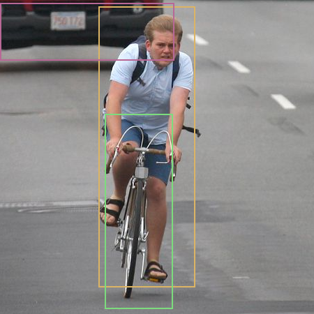

# Generic Inference

**Note**: Please build [Kneron PLUS](../introduction/build_plus.md) before you run examples mentioned below.

**Note**: If you are using Windows, please execute all the instruction below in MSYS2 MinGW 64-bit.

**Note**: To execute **MSYS2 MinGW 64-bit**, please use the shortcut or `c:\msys64\msys2_shell.cmd -mingw64` instead of `c:\msys64\mingw64.exe`.

**Note**: In the inference related examples, we are using KL520 for most demo. If you wish to use KL720, just change the prefix of the example name from kl520 to kl720. (There might be no KL520 version or KL720 version on certain examples.)

**Note**: Few examples will auto connect multiple devices to run inference. If you put hybrid types of devices on host, the inference may fail.

**Note**: If you modify code to change different test image file. Input image aspect ratio is suggested to be aligned to model input aspect ratio.

## Index

- [1. Introduction](#1-introduction)
- [2. Generic Image Inference API](#2-generic-image-inference-api)
    - [2.1 Generic Image Inference With Raw Output](#21-generic-image-inference-with-raw-output)
    - [2.2 Generic Image Inference With Post-Processing on Host](#22-generic-image-inference-with-post-processing-on-host)
    - [2.3 Generic Image Inference With Cropping Image in Pre-Process](#23-generic-image-inference-with-cropping-image-in-pre-process)
    - [2.4 Generic Image Inference Using Model in Flash](#24-generic-image-inference-using-model-in-flash)
- [3. Generic Data Inference API](#3-generic-data-inference-api)
    - [3.1 Generic Data Inference With Pre-Processing on Host](#31-generic-data-inference-with-pre-processing-on-host)

## 1. Introduction

**Generic Inference** contains two sets of APIs, **Generic Image Inference API** and **Generic Data Inference API**.


For **Generic Image Inference API**, images (RGB565, RGBA8888, YUYV422,...) can be provided as the input for the Kneron Device. And Kneron Device provides the automatic hardware image pre-processing including resize, padding, normalization and data re-layout before NPU inference.

For **Generic Data Inference API**, data (or images), which is not supported by automatic hardware image pre-processing, can be used as the input for NPU inference, if and only if the data has been performed pre-processing on Host to the format that model requests on NPU.

The pre-processing on Host includes but not limited to:

1. Resize and/or padding to the size of model request (Image data only)
2. Normalization - model input data normalization
3. Quantization - convert to 8-bit fixed point
4. Re-layout - mapping data to NPU layout format

Please refer following sections for according information:

- [Supported Image Format](../../plus_c/appendix/supported_image_format.md) for the supported image format of hardware image pre-processing.
- [Supported NPU Data Layout Format](../../plus_c/appendix/supported_npu_data_layout_format.md) for the NPU layout format.
- [3.1 Generic Data Inference With Pre-Processing on Host](#31-generic-data-inference-with-pre-processing-on-host) for the demonstration of the pre-processing.

Furthermore, **Generic Inference** provide following functions to retrieve specific output node data (More information please reference *API Reference/Inference API*):

| Retrieve Node Function                               | Description                                                                              |
| ---------------------------------------------------- | ---------------------------------------------------------------------------------------- |
| kp\_generic\_inference\_retrieve\_raw\_fixed\_node() | Retrieves **RAW format data** in fixed-point format on the per-node basis.               |
| kp\_generic\_inference\_retrieve\_fixed\_node()      | Retrieves and converts RAW format data to **fixed-point** data on the per-node basis.    |
| kp\_generic\_inference\_retrieve\_float\_node()      | Retrieves and converts RAW format data to **floating-point** data on the per-node basis. |

Otherwise, if you wish to execute the post-processing on Kneron AI devices (or implement different pre-processing on devices), you should use **Customized Inference API** instead of **Generic Image Inference** or **Generic Data Inference**, and need to develope the code into Kneron AI device's firmware. Please refer [Customize API](./customized_api/introduction.md) for more information.


## 2. Generic Image Inference API

Following examples show the usage of `kp_generic_image_inference_send()` and `kp_generic_image_inference_receive()`.

Generic image inference examples are using the **Generic Image Inference API**, which is intended for advanced users who are interested in developing their models and implement corresponding post-processing code.

**Generic Image Inference API** allows users to directly run a model with an input image and obtain the raw output from the model, without any developments of Kneron AI device's firmware. Please refer [2.1 Generic Image Inference With Raw Output](#21-generic-image-inference-with-raw-output) for the demonstration of the usage.

However, **Generic Image Inference API** can only provide the raw output from the model without post-processing. If you wish to get the result with post-processing, you may implement the corresponding post-processing in Software (Please refer [2.2 Generic Image Inference With Post-Processing on Host](#22-generic-image-inference-with-post-processing-on-host) for the demonstration).

In **Generic Image Inference API**, you may customized what to do in the pre-processing. There are few items are provided:

1. Image Resize
    - You can choose to do or not to do the image resize by setting `resize_mode` in `kp_generic_input_node_image_t` of `kp_generic_image_inference_desc_t`.
2. Image Padding
    - You can choose to do *Symmetric Padding* (Top, Bottom, Left, Right), *Corner Padding* (Right, Bottom), and not to do the image padding by setting `padding_mode` in `kp_generic_input_node_image_t` of `kp_generic_image_inference_desc_t`.
3. Image Cropping
    - You can choose to do or not to do the image cropping by setting `crop_count` and `inf_crop` in `kp_generic_input_node_image_t` of `kp_generic_image_inference_desc_t`.
    - Please refer [2.3 Generic Image Inference With Cropping Image in Pre-Process](#23-generic-image-inference-with-cropping-image-in-pre-process) for the demonstration.
4. Image Format
    - You have to provide the format of the input image correctly by setting `image_format` in `kp_generic_input_node_image_t` of `kp_generic_image_inference_desc_t`.
    - In the pre-process, the image will be convert to the format *RGBA8888*.
5. Data Normalization
    - You can choose to do *Kneron Normalization*, *Tensor Flow Normalization*, *Yolo Normalization*, or other *Customized Normalization* by setting `normalize_mode` in `kp_generic_input_node_image_t` of `kp_generic_image_inference_desc_t`.


### 2.1 Generic Image Inference With Raw Output

The **kl520_demo_generic_image_inference** is an example for showing how it works based on a Tiny Yolo v3 model. And this example dumps floating point values into **.txt** files for each output node.

```bash
$ sudo ./kl520_demo_generic_image_inference
```

```bash
connect device ... OK
upload firmware ... OK
upload model ... OK
read image ... OK

starting inference loop 100 times:
.....................................................

inference loop is done

number of output node : 2

node 0:
width: 7:
height: 7:
channel: 255:
number of data (float): 12495:
first 20 data:
    1.359, 0.340, 0.510, -0.510, 0.170, 0.340,
    -0.849, 0.849, 0.849, 0.510, 0.679,
    0.679, 0.679, 0.510, 0.000, 0.340,
    0.510, 0.510, 0.340, 0.000,

node 1:
width: 14:
height: 14:
channel: 255:
number of data (float): 49980:
first 20 data:
    0.874, -0.349, -0.175, 0.000, 0.000, -0.175,
    0.175, 0.349, -0.175, 0.175, -0.175,
    0.000, -0.175, -0.699, 1.398, 1.048,
    1.048, 0.874, 0.524, 0.699,

dumped node 0 output to 'output_bike_cars_street_224x224_node0_7x7x255.txt'
dumped node 1 output to 'output_bike_cars_street_224x224_node1_14x14x255.txt'
```

### 2.2 Generic Image Inference With Post-Processing on Host

Note: Reference to [Yolo Object Name Mapping](../appendix/yolo_object_name_mapping.md) for the detection result classes.

The **kl520_demo_generic_image_inference_post_yolo** is an example for showing how it gets raw output from device, running a Tiny Yolo v3 model, and does post-processing in the software.

```bash
$ sudo ./kl520_demo_generic_inference_post_yolo
```

```bash
connect device ... OK
upload firmware ... OK
upload model ... OK
read image ... OK

starting inference loop 100 times:
.....................................................

inference loop is done, starting post-processing ...

doing tiny yolo v3 post-processing ...

detectable class count : 80
box count : 6
Box 0 (x1, y1, x2, y2, score, class) = 45.0, 57.0, 93.0, 196.0, 0.965018, 0
Box 1 (x1, y1, x2, y2, score, class) = 43.0, 95.0, 100.0, 211.0, 0.465116, 1
Box 2 (x1, y1, x2, y2, score, class) = 122.0, 68.0, 218.0, 185.0, 0.997959, 2
Box 3 (x1, y1, x2, y2, score, class) = 87.0, 84.0, 131.0, 118.0, 0.499075, 2
Box 4 (x1, y1, x2, y2, score, class) = 28.0, 77.0, 55.0, 100.0, 0.367952, 2
Box 5 (x1, y1, x2, y2, score, class) = 1.0, 84.0, 50.0, 181.0, 0.229727, 2

output bounding boxes on 'output_bike_cars_street_224x224.bmp'

```

And it draws detected objects in a new-created **output_one_bike_many_cars_224x224.bmp**.


### 2.3 Generic Image Inference With Cropping Image in Pre-Process

The **kl520_demo_generic_image_inference_crop** is an example for showing how to do cropping image on device, execute inference only on the cropped areas of image, get the raw output from device, and does post-processing in the software.

The flow in concept:
1. Setting crop information in `kp_generic_input_node_image_t` of `kp_generic_image_inference_desc_t`
2. Send an image to inference
3. Receive result *N* times (*N* specify for number of crop bounding boxes)

```bash
$ sudo ./kl520_demo_generic_image_inference_crop
```

```bash
connect device ... OK
upload firmware ... OK
upload model ... OK
read image ... OK

starting inference loop 50 times:
..................................................

inference loop is done, starting post-processing ...

doing tiny yolo v3 post-processing ...

crop box width : 400
crop box height : 400
crop box number : 0
detectable class count : 80
box count : 6
Box 0 (x1, y1, x2, y2, score, class) = 119.0, 143.0, 399.0, 398.0, 0.941047, 2
Box 1 (x1, y1, x2, y2, score, class) = 248.0, 52.0, 392.0, 155.0, 0.829827, 2
Box 2 (x1, y1, x2, y2, score, class) = 0.0, 96.0, 201.0, 219.0, 0.663775, 2
Box 3 (x1, y1, x2, y2, score, class) = 46.0, 127.0, 218.0, 301.0, 0.624829, 2
Box 4 (x1, y1, x2, y2, score, class) = 158.0, 22.0, 330.0, 109.0, 0.267690, 2
Box 5 (x1, y1, x2, y2, score, class) = 16.0, 79.0, 62.0, 226.0, 0.223999, 2

output bounding boxes on 'output_one_bike_many_cars_800x800_crop0.bmp'

crop box width : 450
crop box height : 450
crop box number : 1
detectable class count : 80
box count : 3
Box 0 (x1, y1, x2, y2, score, class) = 141.0, 9.0, 279.0, 411.0, 0.954721, 0
Box 1 (x1, y1, x2, y2, score, class) = 150.0, 163.0, 247.0, 442.0, 0.787696, 1
Box 2 (x1, y1, x2, y2, score, class) = 0.0, 4.0, 249.0, 86.0, 0.224773, 2

output bounding boxes on 'output_one_bike_many_cars_800x800_crop1.bmp'
```

And it draws detected objects in a new-created **output_one_bike_many_cars_800x800_crop0.bmp** and **output_one_bike_many_cars_800x800_crop1.bmp**.





### 2.4 Generic Image Inference Using Model in Flash

Note: This example is only provided in Kneron PLUS v1.3.0 and above.

The `kl520_demo_generic_image_inference_flash_model` is a example for showing you how to use the model in device flash via `kp_load_model_from_flash()`.

Different from using usb loaded model, the model file must update to device flash first before using `kp_load_model_from_flash()`. Please refer [Write Model to Flash](../introduction/write_model_to_flash.md) for more information.

```bash
$ sudo ./kl520_demo_generic_image_inference_flash_model
```

```bash
connect device ... OK
upload firmware ... OK
loading model from flash ... OK
read image ... OK

starting inference loop 100 times:
....................................................

inference loop is done

number of output node : 2

node 0:
width: 7:
height: 7:
channel: 255:
number of data (float): 12495:
first 20 data:
        1.359, 0.340, 0.510, -0.510, 0.170, 0.340,
        -0.849, 0.849, 0.849, 0.510, 0.679,
        0.679, 0.679, 0.510, 0.000, 0.340,
        0.510, 0.510, 0.340, 0.000,

node 1:
width: 14:
height: 14:
channel: 255:
number of data (float): 49980:
first 20 data:
        0.874, -0.349, -0.175, 0.000, 0.000, -0.175,
        0.175, 0.349, -0.175, 0.175, -0.175,
        0.000, -0.175, -0.699, 1.398, 1.048,
        1.048, 0.874, 0.524, 0.699,

dumped node 0 output to 'output_bike_cars_street_224x224_node0_7x7x255.txt'
dumped node 1 output to 'output_bike_cars_street_224x224_node1_14x14x255.txt'
```

## 3. Generic Data Inference API

Following examples show the usage of `kp_generic_data_inference_send()` and `kp_generic_data_inference_receive()`.

Generic data inference examples are using the **Generic Data Inference API**, which is intended for advanced users who are interested in developing their models with pre-processing code on host and implement corresponding post-processing code.

**Generic Data Inference API** allows users to directly run a model with the well-prepared input data and obtain the raw output from the model, without any developments of Kneron AI device's firmware. Please refer [3.1 Generic Data Inference With Pre-Processing on Host](#31-generic-data-inference-with-pre-processing-on-host) for the demonstration of the usage.

### 3.1 Generic Data Inference With Pre-Processing on Host

The **kl520_demo_generic_data_inference** is an example for showing what to do to images before sending it to Kneron Device as input data.

The Pre-processing includes:

1. Normalization - model input data normalization
2. Quantization - convert to 8-bit fixed point
3. Re-layout - mapping data to NPU layout format

```bash
$ sudo ./kl520_demo_generic_data_inference
```

```bash
connect device ... OK
upload firmware ... OK
upload model ... OK
read image ... OK

starting inference loop 10 times:
..........

inference loop is done.

number of output node : 2

node 0:
width: 7:
height: 7:
channel: 255:
number of data (float): 12495:
first 20 data:
    1.359, 0.340, 0.340, -0.510, 0.340, 0.340,
    -0.849, 0.849, 0.849, 0.510, 0.679,
    0.510, 0.679, 0.679, 0.000, 0.340,
    0.340, 0.510, 0.340, 0.000,

node 1:
width: 14:
height: 14:
channel: 255:
number of data (float): 49980:
first 20 data:
    0.874, -0.349, 0.000, 0.175, 0.000, -0.175,
    0.175, 0.175, 0.175, 0.175, -0.175,
    0.175, -0.175, -0.699, 1.398, 1.048,
    1.048, 0.874, 0.524, 0.699,

dumped node 0 output to 'output_bike_cars_street_224x224_node0_7x7x255.txt'
dumped node 1 output to 'output_bike_cars_street_224x224_node1_14x14x255.txt'
```
