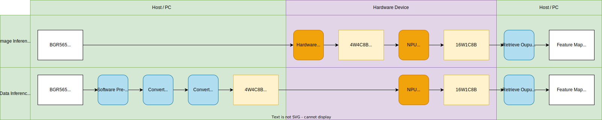
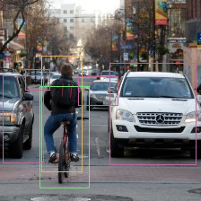
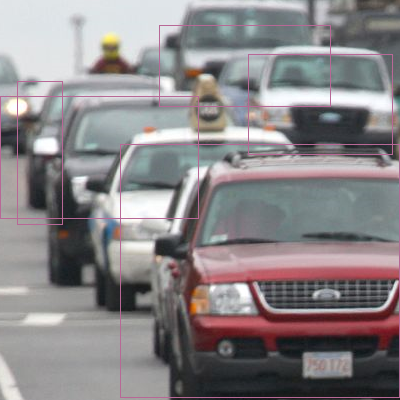
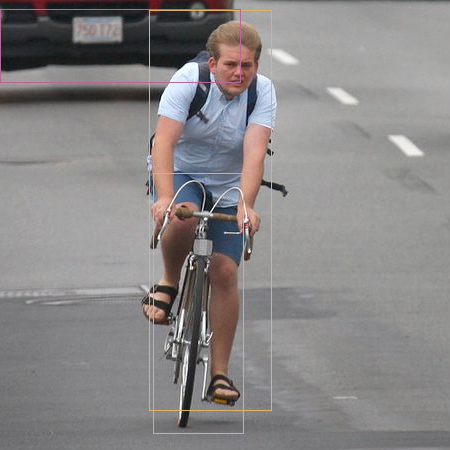

# Generic Inference

**Note**: In the inference related examples, we are using KL520 for most demo. If you wish to use KL630, KL720, or KL730, just change the prefix of the example name from kl520 to kl630, kl720, or kl730. (There might be no KL520 version, KL630 version, KL720 version, or KL730 version on certain examples.)

**Note**: Few examples will auto connect multiple devices to run inference. If you put hybrid types of devices on host, the inference may fail.

**Note**: If you modify code to change different test image file. Input image aspect ratio is suggested to be aligned to model input aspect ratio.


## 1. Introduction

**Generic Inference** contains two sets of APIs, **Generic Image Inference API** and **Generic Data Inference API**.  



For **Generic Image Inference API**, images (RGB565, RGBA8888, YUYV422,...) can be provided as the input for the Kneron Device. And Kneron Device provides the automatic hardware image pre-processing including resize, padding, normalization and data re-layout before NPU inference.

For **Generic Data Inference API**, data (or images), which is not supported by automatic hardware image pre-processing, can be used as the input for NPU inference, if and only if the data has been performed pre-processing on Host to the format that model requests on NPU.

The pre-processing on Host includes but not limited to:

1. Resize and/or padding to the size of model request (Image data only)
2. Normalization - model input data normalization
3. Quantization - convert to 8-bit fixed point
4. Re-layout - mapping data to NPU layout format

Please refer following sections for according information:  

- [Supported Image Format](./../../../plus_c/appendix/supported_image_format.md) for the supported image format of hardware image pre-processing.
- [Supported NPU Data Layout Format](./../../../plus_c/appendix/supported_npu_data_layout_format.md) for the NPU layout format.
- [3.1 Generic Data Inference With Pre-Processing on Host](#31-generic-data-inference-with-pre-processing-on-host) for the demonstration of the pre-processing.

Furthermore, **Generic Inference** provide following functions to retrieve specific output node data (More information please reference *API Reference/Inference API*):

| Retrieve Node Function                                   | Description                                                                              |
| -------------------------------------------------------- | ---------------------------------------------------------------------------------------- |
| kp.inference.generic\_inference\_retrieve\_fixed\_node() | Retrieves and converts RAW format data to **fixed-point** data on the per-node basis.    |
| kp.inference.generic\_inference\_retrieve\_float\_node() | Retrieves and converts RAW format data to **floating-point** data on the per-node basis. |

## 2. Generic Image Inference API

Following examples show the usage of `kp.inference.generic_image_inference_send()` and `kp.inference.generic_image_inference_receive()`.

Generic image inference examples are using the **Generic Image Inference API**, which is intended for advanced users who are interested in developing their models and implement corresponding post-processing code.

**Generic Image Inference API** allows users to directly run a model with an input image and obtain the raw output from the model, without any developments of Kneron AI device's firmware. Please refer [2.1 Generic Image Inference With Raw Output](#21-generic-image-inference-with-raw-output) for the demonstration of the usage.

However, **Generic Image Inference API** can only provide the raw output from the model without post-processing. If you wish to get the result with post-processing, you may implement the corresponding post-processing in Software (Please refer [2.2 Generic Image Inference With Post-Processing on Host](#22-generic-image-inference-with-post-processing-on-host) for the demonstration).

In **Generic Image Inference API**, you may customized what to do in the pre-processing. There are few items are provided:

1. Image Resize
    - You can choose to do or not to do the image resize by setting `resize_mode` in `kp.GenericInputNodeImage` of `kp.GenericImageInferenceDescriptor`.
2. Image Padding
    - You can choose to do *Symmetric Padding* (Top, Bottom, Left, Right), *Corner Padding* (Right, Bottom), and not to do the image padding by setting `padding_mode` in `kp.GenericInputNodeImage` of `kp.GenericImageInferenceDescriptor`.
3. Image Cropping
    - You can choose to do or not to do the image cropping by setting `inference_crop_box_list` in `kp.GenericInputNodeImage` of `kp.GenericImageInferenceDescriptor`.
    - Please refer [2.3 Generic Image Inference With Cropping Image in Pre-Process](#23-generic-image-inference-with-cropping-image-in-pre-process) for the demonstration.
4. Image Format
    - You have to provide the format of the input image correctly by setting `image_format` in `kp.GenericInputNodeImage` of `kp.GenericImageInferenceDescriptor`.
    - In the pre-process, the image will be convert to the format *RGBA8888*.
5. Data Normalization
    - You can choose to do *Kneron Normalization*, *Tensor Flow Normalization*, *Yolo Normalization*, or other *Customized Normalization* by setting `normalize_mode` in `kp.GenericInputNodeImage` of `kp.GenericImageInferenceDescriptor`.


### 2.1 Generic Image Inference With Raw Output

The **KL520DemoGenericImageInference** not do any post-processing and prints feature map raw output for each output node.

```bash
$ python3 KL520DemoGenericImageInference.py

[Connect Device]
 - Success
[Set Device Timeout]
 - Success
[Upload Firmware]
 - Success
[Upload Model]
 - Success
[Read Image]
 - Success
[Starting Inference Work]
 - Starting inference loop 10 times
 - ..........
[Retrieve Inference Node Output ]
 - Success
[Result]
[{
    "name": "",
    "shape": [
        1,
        255,
        7,
        7
    ],
    "channels_ordering": "ChannelOrdering.KP_CHANNEL_ORDERING_CHW",
    "num_data": 12495,
    "ndarray": [
        "[[[[  1.3589103    0.33972758   0.5095914  ...   0.16986379",
        "      0.33972758  -0.849319  ]",
        "   [  1.698638    -0.5095914    0.5095914  ...  -0.16986379",
        "     -0.16986379  -0.849319  ]",
        "   [  1.5287741    0.5095914    0.16986379 ...   0.",
        "     -0.33972758  -0.5095914 ]",
        "   ...",
        "   [ -7.643871    -9.682237   -10.361691   ...  -9.002781",
        "    -10.021964    -9.172645  ]",
        "   [ -7.304143   -10.701419   -12.400057   ...  -9.682237",
        "     -9.682237    -9.002781  ]",
        "   [ -6.1150966   -8.153462    -9.342508   ...  -7.983598",
        "     -8.153462    -8.49319   ]]]]"
    ]
}, {
    "name": "",
    "shape": [
        1,
        255,
        14,
        14
    ],
    "channels_ordering": "ChannelOrdering.KP_CHANNEL_ORDERING_CHW",
    "num_data": 49980,
    "ndarray": [
        "[[[[  0.87369454  -0.3494778   -0.1747389  ...   0.",
        "     -0.1747389   -0.6989556 ]",
        "   [  0.6989556   -0.87369454  -0.6989556  ...  -0.5242167",
        "     -0.1747389   -0.5242167 ]",
        "   [  0.5242167   -0.87369454  -0.6989556  ...  -0.1747389",
        "      0.1747389   -0.87369454]",
        "   ...",
        "   [-11.18329    -15.377024   -18.172846   ... -13.105417",
        "    -12.581201   -10.833812  ]",
        "   [-10.134856   -14.1538515  -16.774935   ... -10.659073",
        "     -9.61064     -8.387467  ]",
        "   [ -9.086423   -12.231723   -12.930678   ... -10.134856",
        "     -9.261162    -7.339034  ]]]]"
    ]
}]
```

### 2.2 Generic Image Inference With Post-Processing on Host

**Note**: Reference to [Yolo Object Name Mapping](./../../../plus_c/appendix/yolo_object_name_mapping.md) for the detection result classes of YOLO examples.  

The **'KL520DemoGenericImageInferencePostYolo.py'** is an example for showing how it gets raw output from device, running a Tiny Yolo v3 model, and does post-processing in the software (host side).

```bash
$ python3 KL520DemoGenericImageInferencePostYolo.py

[Connect Device]
 - Success
[Set Device Timeout]
 - Success
[Upload Firmware]
 - Success
[Upload Model]
 - Success
[Read Image]
 - Success
[Starting Inference Work]
 - Starting inference loop 50 times
 - ..................................................
[Retrieve Inference Node Output ]
 - Success
[Tiny Yolo V3 Post-Processing]
 - Success
[Result]
{
    "class_count": 80,
    "box_count": 6,
    "box_list": {
        "0": {
            "x1": 46,
            "y1": 62,
            "x2": 91,
            "y2": 191,
            "score": 0.965,
            "class_num": 0
        },
        "1": {
            "x1": 44,
            "y1": 96,
            "x2": 99,
            "y2": 209,
            "score": 0.4651,
            "class_num": 1
        },
        "2": {
            "x1": 122,
            "y1": 70,
            "x2": 218,
            "y2": 183,
            "score": 0.998,
            "class_num": 2
        },
        "3": {
            "x1": 87,
            "y1": 85,
            "x2": 131,
            "y2": 117,
            "score": 0.4991,
            "class_num": 2
        },
        "4": {
            "x1": 28,
            "y1": 77,
            "x2": 55,
            "y2": 100,
            "score": 0.368,
            "class_num": 2
        },
        "5": {
            "x1": 3,
            "y1": 84,
            "x2": 48,
            "y2": 181,
            "score": 0.2297,
            "class_num": 2
        }
    }
}
[Output Result Image]
 - Output bounding boxes on 'output_bike_cars_street_224x224.bmp'
```

And it draws detected objects in a new-created **output_bike_cars_street_224x224.bmp**.



### 2.3 Generic Image Inference With Cropping Image in Pre-Process

**Note**: Reference to [Yolo Object Name Mapping](./../../../plus_c/appendix/yolo_object_name_mapping.md) for the detection result classes of YOLO examples.  

The **'KL520DemoGenericImageInferenceCrop.py'** is an example for showing how to do cropping image on device, execute inference only on the cropped areas of image, get the raw output from device, and does post-processing in the software.

The flow in concept:
1. Setting crop information in `kp.GenericInputNodeImage` of `kp.GenericImageInferenceDescriptor`
2. Send an image to inference
3. Receive result *N* times (*N* specify for number of crop bounding boxes)

```bash
$ python3 KL520DemoGenericImageInferenceCrop.py

[Connect Device]
 - Success
[Set Device Timeout]
 - Success
[Upload Firmware]
 - Success
[Upload Model]
 - Success
[Read Image]
 - Success
[Starting Inference Work]
 - Starting inference loop 50 times
 - ..................................................
 - Retrieve 2 Nodes Success
[Post-Processing]
 - Success
[Result]
 - total inference 50 images

[Crop Box 0]
 - [Crop Box Information]
{
    "crop_box_index": 0,
    "x": 0,
    "y": 0,
    "width": 400,
    "height": 400
}
 - [Crop Box Result]
{
    "class_count": 80,
    "box_count": 5,
    "box_list": {
        "0": {
            "x1": 120,
            "y1": 144,
            "x2": 399,
            "y2": 397,
            "score": 0.941,
            "class_num": 2
        },
        "1": {
            "x1": 248,
            "y1": 54,
            "x2": 392,
            "y2": 154,
            "score": 0.8298,
            "class_num": 2
        },
        "2": {
            "x1": 0,
            "y1": 96,
            "x2": 198,
            "y2": 218,
            "score": 0.6638,
            "class_num": 2
        },
        "3": {
            "x1": 159,
            "y1": 25,
            "x2": 330,
            "y2": 106,
            "score": 0.2677,
            "class_num": 2
        },
        "4": {
            "x1": 17,
            "y1": 81,
            "x2": 62,
            "y2": 224,
            "score": 0.224,
            "class_num": 2
        }
    }
}

[Crop Box 1]
 - [Crop Box Information]
{
    "crop_box_index": 1,
    "x": 230,
    "y": 335,
    "width": 450,
    "height": 450
}
 - [Crop Box Result]
{
    "class_count": 80,
    "box_count": 3,
    "box_list": {
        "0": {
            "x1": 151,
            "y1": 8,
            "x2": 275,
            "y2": 409,
            "score": 0.9469,
            "class_num": 0
        },
        "1": {
            "x1": 146,
            "y1": 191,
            "x2": 258,
            "y2": 419,
            "score": 0.8208,
            "class_num": 1
        },
        "2": {
            "x1": 0,
            "y1": 11,
            "x2": 241,
            "y2": 84,
            "score": 0.3528,
            "class_num": 2
        }
    }
}
[Output Result Image]
 - Output bounding boxes on 'output_one_bike_many_cars_800x800_crop0.bmp'
 - Output bounding boxes on 'output_one_bike_many_cars_800x800_crop1.bmp'
```

And it draws detected objects in a new-created **output_one_bike_many_cars_800x800_crop0.bmp** and **output_one_bike_many_cars_800x800_crop1.bmp**.






### 2.4 Generic Image Inference Using Model in Flash

Note: This example is only provided in Kneron PLUS v1.3.0 and above.

The `KL520DemoGenericImageInferenceFlashModel.py` is a example for showing you how to use the model in device flash via `kp.core.load_firmware_from_file()`.

Different from using usb loaded model, the model file must update to device flash first before using `kp.core.load_firmware_from_file()`. Please refer [Write Model to Flash](./../../introduction/write_model_to_flash.md) for more information.

```bash
$ python3 KL520DemoGenericImageInferenceFlashModel.py

[Connect Device]
 - Success
[Set Device Timeout]
 - Success
[Upload Firmware]
 - Success
[Load Model from Flash]
 - Success
[Read Image]
 - Success
[Starting Inference Work]
 - Starting inference loop 50 times
 - ..................................................
[Retrieve Inference Node Output ]
 - Success
[Result]
[{
    "name": "",
    "shape": [
        1,
        255,
        7,
        7
    ],
    "channels_ordering": "ChannelOrdering.KP_CHANNEL_ORDERING_CHW",
    "num_data": 12495,
    "ndarray": [
        "[[[[  1.3589103    0.33972758   0.5095914  ...   0.16986379",
        "      0.33972758  -0.849319  ]",
        "   [  1.698638    -0.5095914    0.5095914  ...  -0.16986379",
        "     -0.16986379  -0.849319  ]",
        "   [  1.5287741    0.5095914    0.16986379 ...   0.",
        "     -0.33972758  -0.5095914 ]",
        "   ...",
        "   [ -7.643871    -9.682237   -10.361691   ...  -9.002781",
        "    -10.021964    -9.172645  ]",
        "   [ -7.304143   -10.701419   -12.400057   ...  -9.682237",
        "     -9.682237    -9.002781  ]",
        "   [ -6.1150966   -8.153462    -9.342508   ...  -7.983598",
        "     -8.153462    -8.49319   ]]]]"
    ]
}, {
    "name": "",
    "shape": [
        1,
        255,
        14,
        14
    ],
    "channels_ordering": "ChannelOrdering.KP_CHANNEL_ORDERING_CHW",
    "num_data": 49980,
    "ndarray": [
        "[[[[  0.87369454  -0.3494778   -0.1747389  ...   0.",
        "     -0.1747389   -0.6989556 ]",
        "   [  0.6989556   -0.87369454  -0.6989556  ...  -0.5242167",
        "     -0.1747389   -0.5242167 ]",
        "   [  0.5242167   -0.87369454  -0.6989556  ...  -0.1747389",
        "      0.1747389   -0.87369454]",
        "   ...",
        "   [-11.18329    -15.377024   -18.172846   ... -13.105417",
        "    -12.581201   -10.833812  ]",
        "   [-10.134856   -14.1538515  -16.774935   ... -10.659073",
        "     -9.61064     -8.387467  ]",
        "   [ -9.086423   -12.231723   -12.930678   ... -10.134856",
        "     -9.261162    -7.339034  ]]]]"
    ]
}]
```

## 3. Generic Data Inference API

Following examples show the usage of `kp.inference.generic_data_inference_send()` and `kp.inference.generic_data_inference_receive()`.

Generic data inference examples are using the **Generic Data Inference API**, which is intended for advanced users who are interested in developing their models with pre-processing code on host and implement corresponding post-processing code.

**Generic Data Inference API** allows users to directly run a model with the well-prepared input data and obtain the raw output from the model, without any developments of Kneron AI device's firmware. Please refer [3.1 Generic Data Inference With Pre-Processing on Host](#31-generic-data-inference-with-pre-processing-on-host) for the demonstration of the usage.

### 3.1 Generic Data Inference With Pre-Processing on Host

The **KL520DemoGenericDataInference.py** is an example for showing what to do software pre-processing on host side before sending it to Kneron Device as input data.

The software pre-processing includes:

1. Normalization - model input data normalization
2. Quantization - convert to 8-bit fixed point
3. Re-layout - mapping data to NPU layout format

```bash
$ python3 KL520DemoGenericDataInference.py

[Connect Device]
 - Success
[Set Device Timeout]
 - Success
[Upload Firmware]
 - Success
[Upload Model]
 - Success
[Prepare NPU Inference Data]
 - Success
[Starting Inference Work]
 - Starting inference loop 10 times
 - ..........
[Retrieve Inference Node Output ]
 - Success
[Tiny Yolo V3 Post-Processing]
 - Success
[Result]
{
    "class_count": 80,
    "box_count": 6,
    "box_list": {
        "0": {
            "x1": 46,
            "y1": 62,
            "x2": 91,
            "y2": 191,
            "score": 0.9704,
            "class_num": 0
        },
        "1": {
            "x1": 44,
            "y1": 96,
            "x2": 99,
            "y2": 209,
            "score": 0.5356,
            "class_num": 1
        },
        "2": {
            "x1": 122,
            "y1": 70,
            "x2": 217,
            "y2": 183,
            "score": 0.9976,
            "class_num": 2
        },
        "3": {
            "x1": 87,
            "y1": 85,
            "x2": 131,
            "y2": 117,
            "score": 0.4992,
            "class_num": 2
        },
        "4": {
            "x1": 28,
            "y1": 77,
            "x2": 56,
            "y2": 99,
            "score": 0.4109,
            "class_num": 2
        },
        "5": {
            "x1": 3,
            "y1": 84,
            "x2": 48,
            "y2": 181,
            "score": 0.2346,
            "class_num": 2
        }
    }
}
```
