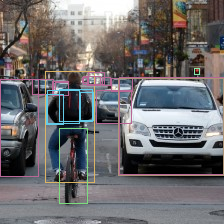
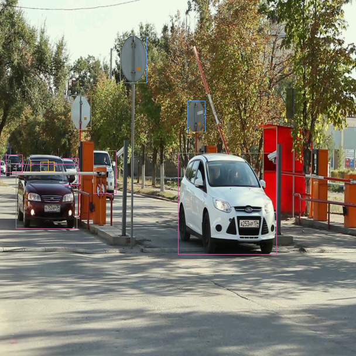
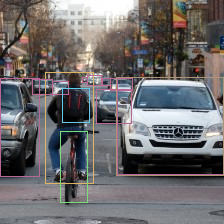

# Getting Started

> **Note 1**: We run the examples below under OS Ubuntu 18.04.5 LTS with Kenron KL520/KL630/KL720/KL730 AI device.  

> **Note 2**: The example below is under the assumption that device is connected and recognized by host machine correctly. For the operations, please refer to section [Install dependency](./introduction/install_dependency.md)  

> **Note 3**: Refer to [Kneron PLUS Introduction](./introduction/introduction.md) for feature details  

## 1. Introduction

In this document, we will introduce **Kneron PLUS** (*Platform Library Unified Software*) framework to demostrate the usage of Kneron AI device from host software. When referring to a complete AI application development, actually three parts are involved:

- **model development**
- **software development**
- **firmware development**

This **Getting Started** document only focuses on host software usage with the AI device to perform following functionality.

- **How to upgrade the AI device to KDP2 firmware loader.**
- **How to install the software package**
- **How to run the generic inference example.**

For **model development**, please refer the [Toolchain Docker](../toolchain/manual_1_overview.md) part.

For **firmware development**, please refer the documents in [Customized API **(C language documents)** .](./../plus_c/feature_guide/customized_api/introduction.md)


## 2. Update AI Device to KDP2 Firmware

**Note 1**: For the Windows users, please refer [Install Dependency](./introduction/install_dependency.md#2-install-kneron-ai-device-driver-on-windows-10) for the installation of the driver.

**Note 2**: For details, please refer [Upgrade AI Device to KDP2 Firmware](./introduction/upgrade_ai_device_to_kdp2.md).

---

Before running PLUS examples, users need to make the AI device running with the KDP2 firmware loader.

Download the *KneronDFUT_ubuntu.zip* into Ubuntu in from https://www.kneron.com/tw/support/developers/. It is located at **Kneron PLUS** section.

```bash
$ unzip KneronDFUT_ubuntu.zip
$ cd Kneron_DFUT/
$ chmod +x bin/KneronDFUT # optional
```

Use Command Line

```bash
$ sudo sh KneronDFUT.sh --help
```

```bash
[Display help message]
    --help                : [no argument]         help message

[Scan and list all information]
    --list                : [no argument]         list all dongles information

[Update dongles to usb boot] (Only works for KL520)
    --kl520-usb-boot      : [no argument]         choose update to Usb Boot
    --port                : [argument required]   port id set ("all" or specified multiple port ids "13,537")

[Update dongles to flash boot] (Only works for KL520)
    --kl520-flash-boot    : [no argument]         choose update to Flash Boot
    --port                : [argument required]   port id set ("all" or specified multiple port ids "13,537")
    --scpu                : [argument required]   self pointed scpu firmware file path (.bin)
    --ncpu                : [argument required]   self pointed ncpu firmware file path (.bin)

[Update firmware file to flash memory in dongles (Only works for KL720)
    --kl720-update        : [no argument]         choose write firmware to flash memory
    --port                : [argument required]   port id set ("all" or specified multiple port ids "13,537")
    --scpu                : [argument required]   self pointed scpu firmware file path (.bin)
    --ncpu                : [argument required]   self pointed ncpu firmware file path (.bin)

[Update model file to flash memory in dongles
    --model-to-flash      : [argument required]   self pointed model file path (.nef)
    --type                : [argument required]   type of device ("KL520" or "KL720")
    --port                : [argument required]   port id set ("all" or specified multiple port ids "13,537")

[Enable Graphic User Interface]
    --gui                 : [no argument]         display GUI

[Get Current Kneron DFUT Version]
    --version             : [no argument]         display the version of Kneron DFUT
```

### 2.1 KL520

1. Use GUI to Update AI Device

    ```bash
    $ sudo sh KneronDFUT.sh
    ```

    * Select the AI device to be update to KDP2 firmware
    * Push **Run** button
      \(**Update to USB Boot** should be checked by default\)

    

2. Use Command Line to Update AI Device

    ```bash
    $ sudo sh KneronDFUT.sh --list
    ```

    ```bash
    ===========================================
    Index:          1
    Port Id:        133
    Kn Number:      0x270A265C
    Device Type:    KL520
    FW Type:        KDP
    Usb Speed:      High-Speed
    Connectable:    true
    ===========================================
    ```

    ```bash
    $ sudo sh KneronDFUT.sh --kl520-usb-boot --port 133
    ```

    ```bash
    Start Update Device with Port Id 133 to USB Boot

    ==== Update of Device with Port Id: 133 Succeeded ====
    ```

### 2.2 KL630

1. Use GUI to Update AI Device

    ```bash
    $ sudo sh KneronDFUT.sh
    ```

    * Select the AI device to be update to KDP2 firmware

    * Push **Run** button
      \(**Update to USB Boot** should be checked by default\)

    

### 2.3 KL720

1. Use GUI to Update AI Device

    ```bash
    $ sudo sh KneronDFUT.sh
    ```

    * Select **KL720** Tab.

    * Select the KL720 devices to be update to KDP2 frimware.

    * Select **Update Firmware to Flash**

    * Manually choose **SCPU firmware file** and **NCPU firmware file**.
    	* The firmware files can be found in **${PLUS_FOLDER}/res/firmware/KL720/**

    * Push **Run** button.

    


2. Use Command Line to Update AI Device

    ```bash
    $ sudo sh KneronDFUT.sh --list
    ```

    ```bash
    ===========================================
    Index:          1
    Port Id:        262
    Kn Number:      0x2004142C
    Device Type:    KL720
    FW Type:        KDP
    Usb Speed:      Super-Speed
    Connectable:    true
    ===========================================
    ```

    ```bash
    $ sudo sh KneronDFUT.sh --kl720-update --port 262 --scpu ${SCPU_FILE_PATH} --ncpu ${NCPU_FILE_PATH}
    ```

    ```bash
    Start Update Firmware to Device with Port Id 262

    ==== Update Firmware to Device with Port Id: 262 Succeeded ====
    ```

### 2.4 KL730

1. Use GUI to Update AI Device

    ```bash
    $ sudo sh KneronDFUT.sh
    ```

    * Select the AI device to be update to KDP2 firmware

    * Push **Run** button
      \(**Update to USB Boot** should be checked by default\)

    

2. Use Command Line to Update AI Device

    ```bash
    $ sudo sh KneronDFUT.sh --list
    ```

    ```bash
    ===========================================
    Index:          1
    Port Id:        13
    Kn Number:      0x19611034
    Device Type:    KL730
    FW Type:        KDP2
    Usb Speed:      Super-Speed
    Connectable:    true
    ===========================================
    ```

    ```bash
    $ sudo sh KneronDFUT.sh --kl730-usb-boot --port 13
    ```

    ```bash
    Start Update Device with Port Id 13 to USB Boot

    ==== Update of Device with Port Id: 13 Succeeded ====
    ```


---

## 3. Install Kneron PLUS Python Package

- Upgrade pip (pip version >= 21.X.X):
    ```bash
    $ python -m pip install --upgrade pip
    ```

- Install the package with pip:
    ```bash
    $ cd ./package/{platform}/
    $ pip install KneronPLUS-{version}-py3-none-any.whl
    ```

- Install the examples requirement package with pip:
    ```bash
    $ pip install opencv-python
    ```

- Common problem:  

    If pip install/run application fails, it may cause by using python 2.X as python interpreter. Please make sure the interpreter and pip is `Python 3` on the host:  

    ```bash
    # check pip version
    $ pip -V
    $ pip3 -V

    # check python interpreter version
    $ python -V
    $ python3 -V
    ```

    You also can install package by specify python interpreter by following scripts:  
    ```bash
    $ python -m pip install {package_path}
    # or
    $ python3 -m pip install {package_path}
    ```

> **Note**: **[Ubuntu][Raspberry Pi]** Please update Kneron device USB permission before following steps on Ubuntu. See the [Installation
](./introduction/install_dependency.md) for details.  

## 4. Run Inference Examples

The PLUS provides two categories of API set for model inference.

1. **Generic inference** category which is intended for advanced users who are interested in developing their models and implement corresponding post-processing code.

2. **Customized inference (C Language Only)** category which is intended for advanced users who are interested in developing their models and implement corresponding post-processing code **on Kneron AI devices** (or implement different pre-processing on devices)

Below will demonstrate only usage in two examples for **Generic inference**. For **Customized inference (C Language Only)**, please refer the [**C language documents**](./../plus_c/getting_started.md).

### 4.1 Generic Inference Example

**Generic inference** API is intended for users who have their own models and applications. It needs the post-process is implemented by users in host side.

#### 4.1.1 KL520 Generic Inference Example
The **'KL520DemoGenericImageInferencePostYolo.py'** is an example for showing how it work.

By default, it runs with a Tiny Yolo v3 model NEF and takes an BMP image as input and does post-process in host side.

```bash
$ python KL520DemoGenericImageInferencePostYolo.py

[Connect Device]
 - Success
[Set Device Timeout]
 - Success
[Upload Firmware]
 - Success
[Upload Model]
 - Success
[Read Image]
 - Success
[Starting Inference Work]
 - Starting inference loop 50 times
 - ..................................................
[Retrieve Inference Node Output ]
 - Success
[Tiny Yolo V3 Post-Processing]
 - Success
[Result]
{
    "class_count": 80,
    "box_count": 6,
    "box_list": {
        "0": {
            "x1": 46,
            "y1": 62,
            "x2": 91,
            "y2": 191,
            "score": 0.965,
            "class_num": 0
        },
        "1": {
            "x1": 44,
            "y1": 96,
            "x2": 99,
            "y2": 209,
            "score": 0.4651,
            "class_num": 1
        },
        "2": {
            "x1": 122,
            "y1": 70,
            "x2": 218,
            "y2": 183,
            "score": 0.998,
            "class_num": 2
        },
        "3": {
            "x1": 87,
            "y1": 85,
            "x2": 131,
            "y2": 117,
            "score": 0.4991,
            "class_num": 2
        },
        "4": {
            "x1": 28,
            "y1": 77,
            "x2": 55,
            "y2": 100,
            "score": 0.368,
            "class_num": 2
        },
        "5": {
            "x1": 3,
            "y1": 84,
            "x2": 48,
            "y2": 181,
            "score": 0.2297,
            "class_num": 2
        }
    }
}
[Output Result Image]
 - Output bounding boxes on 'output_bike_cars_street_224x224.bmp'
```

From the console output, it can be observed that the information of models in the NEF is printed, including model ID, raw resolution, input channel, raw image format and raw output size.

Besides output results in the screen console, it also draws detected objects in a new-created **output_bike_cars_street_224x224.bmp**.


#### 4.1.2 KL630 Generic Inference Example
The **'KL630DemoGenericImageInferencePostYolo.py'** is an example for showing how it work.

By default, it runs with a YOLO v5s model NEF and takes an BMP image as input and does post-process in host side.

```bash
$ python KL630DemoGenericImageInferencePostYolo.py

[Connect Device]
 - Success
[Set Device Timeout]
 - Success
[Upload Firmware]
 - Success
[Upload Model]
 - Success
[Read Image]
 - Success
[Starting Inference Work]
 - Starting inference loop 50 times
 - ..................................................
[Retrieve Inference Node Output ]
 - Success
[Yolo V5s Post-Processing]
 - Success
[Result]
{
    "class_count": 80,
    "box_count": 20,
    "box_list": {
        "0": {
            "x1": 45,
            "y1": 71,
            "x2": 94,
            "y2": 182,
            "score": 0.8449,
            "class_num": 0
        },
        "1": {
            "x1": 59,
            "y1": 128,
            "x2": 87,
            "y2": 203,
            "score": 0.5845,
            "class_num": 1
        },
        "2": {
            "x1": 96,
            "y1": 90,
            "x2": 131,
            "y2": 123,
            "score": 0.8682,
            "class_num": 2
        },
        "3": {
            "x1": 0,
            "y1": 79,
            "x2": 38,
            "y2": 176,
            "score": 0.8558,
            "class_num": 2
        },
        "4": {
            "x1": 111,
            "y1": 78,
            "x2": 132,
            "y2": 91,
            "score": 0.7229,
            "class_num": 2
        },
        "5": {
            "x1": 32,
            "y1": 79,
            "x2": 53,
            "y2": 94,
            "score": 0.6963,
            "class_num": 2
        },
        "6": {
            "x1": 87,
            "y1": 76,
            "x2": 100,
            "y2": 85,
            "score": 0.6006,
            "class_num": 2
        },
        "7": {
            "x1": 52,
            "y1": 81,
            "x2": 68,
            "y2": 95,
            "score": 0.5999,
            "class_num": 2
        },
        "8": {
            "x1": 119,
            "y1": 77,
            "x2": 223,
            "y2": 174,
            "score": 0.5981,
            "class_num": 2
        },
        "9": {
            "x1": 102,
            "y1": 77,
            "x2": 110,
            "y2": 85,
            "score": 0.4883,
            "class_num": 2
        },
        "10": {
            "x1": 82,
            "y1": 77,
            "x2": 87,
            "y2": 82,
            "score": 0.3307,
            "class_num": 2
        },
        "11": {
            "x1": 88,
            "y1": 72,
            "x2": 104,
            "y2": 84,
            "score": 0.1816,
            "class_num": 2
        },
        "12": {
            "x1": 83,
            "y1": 76,
            "x2": 95,
            "y2": 84,
            "score": 0.1577,
            "class_num": 2
        },
        "13": {
            "x1": 55,
            "y1": 82,
            "x2": 68,
            "y2": 90,
            "score": 0.155,
            "class_num": 2
        },
        "14": {
            "x1": 118,
            "y1": 78,
            "x2": 223,
            "y2": 175,
            "score": 0.3757,
            "class_num": 7
        },
        "15": {
            "x1": 194,
            "y1": 68,
            "x2": 199,
            "y2": 74,
            "score": 0.3488,
            "class_num": 9
        },
        "16": {
            "x1": 59,
            "y1": 89,
            "x2": 92,
            "y2": 121,
            "score": 0.4136,
            "class_num": 24
        },
        "17": {
            "x1": 80,
            "y1": 92,
            "x2": 93,
            "y2": 120,
            "score": 0.3071,
            "class_num": 24
        },
        "18": {
            "x1": 47,
            "y1": 90,
            "x2": 79,
            "y2": 123,
            "score": 0.177,
            "class_num": 24
        },
        "19": {
            "x1": 46,
            "y1": 94,
            "x2": 63,
            "y2": 124,
            "score": 0.1531,
            "class_num": 24
        }
    }
}
[Output Result Image]
 - Output bounding boxes on 'output_bike_cars_street_224x224.bmp'
```

From the console output, it can be observed that the information of models in the NEF is printed, including model ID, raw resolution, input channel, raw image format and raw output size.

Besides output results in the screen console, it also draws detected objects in a new-created **output_bike_cars_street_224x224.bmp**.



#### 4.1.3 KL720 Generic Inference Example
The **'KL720DemoGenericImageInferencePostYolo.py'** is an example for showing how it work.

By default, it runs with a YOLO v5s model NEF and takes an BMP image as input and does post-process in host side.

```bash
$ python KL720DemoGenericImageInferencePostYolo.py

[Connect Device]
 - Success
[Set Device Timeout]
 - Success
[Upload Model]
 - Success
[Read Image]
 - Success
[Starting Inference Work]
 - Starting inference loop 50 times
 - ..................................................
[Retrieve Inference Node Output ]
 - Success
[Yolo V5s Post-Processing]
 - Success
[Result]
{
    "class_count": 80,
    "box_count": 11,
    "box_list": {
        "0": {
            "x1": 52,
            "y1": 273,
            "x2": 82,
            "y2": 293,
            "score": 0.2027,
            "class_num": 0
        },
        "1": {
            "x1": 69,
            "y1": 276,
            "x2": 92,
            "y2": 292,
            "score": 0.1589,
            "class_num": 0
        },
        "2": {
            "x1": 304,
            "y1": 261,
            "x2": 472,
            "y2": 434,
            "score": 0.8715,
            "class_num": 2
        },
        "3": {
            "x1": 159,
            "y1": 257,
            "x2": 198,
            "y2": 330,
            "score": 0.6647,
            "class_num": 2
        },
        "4": {
            "x1": 10,
            "y1": 264,
            "x2": 38,
            "y2": 294,
            "score": 0.6482,
            "class_num": 2
        },
        "5": {
            "x1": 0,
            "y1": 273,
            "x2": 17,
            "y2": 301,
            "score": 0.6206,
            "class_num": 2
        },
        "6": {
            "x1": 107,
            "y1": 270,
            "x2": 134,
            "y2": 316,
            "score": 0.5405,
            "class_num": 2
        },
        "7": {
            "x1": 27,
            "y1": 280,
            "x2": 131,
            "y2": 390,
            "score": 0.2179,
            "class_num": 2
        },
        "8": {
            "x1": 121,
            "y1": 163,
            "x2": 155,
            "y2": 221,
            "score": 0.8449,
            "class_num": 11
        },
        "9": {
            "x1": 205,
            "y1": 61,
            "x2": 250,
            "y2": 141,
            "score": 0.6976,
            "class_num": 11
        },
        "10": {
            "x1": 320,
            "y1": 172,
            "x2": 350,
            "y2": 225,
            "score": 0.6899,
            "class_num": 11
        }
    }
}
[Output Result Image]
 - Output bounding boxes on 'output_car_park_barrier_608x608.bmp'
```

From the console output, it can be observed that the information of models in the NEF is printed, including model ID, raw resolution, input channel, raw image format and raw output size.

Besides output results in the screen console, it also draws detected objects in a new-created **output_car_park_barrier_608x608.bmp**.



#### 4.1.4 KL730 Generic Inference Example
The **'KL730DemoGenericImageInferencePostYolo.py'** is an example for showing how it work.

By default, it runs with a YOLO v5s model NEF and takes an BMP image as input and does post-process in host side.

```bash
$ python KL730DemoGenericImageInferencePostYolo.py

[Connect Device]
 - Success
[Set Device Timeout]
 - Success
[Upload Firmware]
 - Success
[Upload Model]
 - Success
[Read Image]
 - Success
[Starting Inference Work]
 - Starting inference loop 50 times
 - ..................................................
[Retrieve Inference Node Output ]
 - Success
[Yolo V5s Post-Processing]
 - Success
[Result]
{
    "class_count": 80,
    "box_count": 20,
    "box_list": {
        "0": {
            "x1": 46,
            "y1": 71,
            "x2": 93,
            "y2": 182,
            "score": 0.8372,
            "class_num": 0
        },
        "1": {
            "x1": 59,
            "y1": 129,
            "x2": 87,
            "y2": 202,
            "score": 0.6383,
            "class_num": 1
        },
        "2": {
            "x1": 96,
            "y1": 90,
            "x2": 131,
            "y2": 123,
            "score": 0.8604,
            "class_num": 2
        },
        "3": {
            "x1": 0,
            "y1": 80,
            "x2": 38,
            "y2": 175,
            "score": 0.8552,
            "class_num": 2
        },
        "4": {
            "x1": 110,
            "y1": 78,
            "x2": 133,
            "y2": 91,
            "score": 0.7306,
            "class_num": 2
        },
        "5": {
            "x1": 32,
            "y1": 79,
            "x2": 52,
            "y2": 95,
            "score": 0.7114,
            "class_num": 2
        },
        "6": {
            "x1": 52,
            "y1": 81,
            "x2": 68,
            "y2": 94,
            "score": 0.6152,
            "class_num": 2
        },
        "7": {
            "x1": 118,
            "y1": 79,
            "x2": 223,
            "y2": 174,
            "score": 0.6088,
            "class_num": 2
        },
        "8": {
            "x1": 87,
            "y1": 76,
            "x2": 101,
            "y2": 85,
            "score": 0.5875,
            "class_num": 2
        },
        "9": {
            "x1": 102,
            "y1": 77,
            "x2": 110,
            "y2": 84,
            "score": 0.5383,
            "class_num": 2
        },
        "10": {
            "x1": 82,
            "y1": 77,
            "x2": 87,
            "y2": 82,
            "score": 0.2922,
            "class_num": 2
        },
        "11": {
            "x1": 45,
            "y1": 80,
            "x2": 63,
            "y2": 95,
            "score": 0.2365,
            "class_num": 2
        },
        "12": {
            "x1": 14,
            "y1": 68,
            "x2": 27,
            "y2": 81,
            "score": 0.1773,
            "class_num": 2
        },
        "13": {
            "x1": 83,
            "y1": 77,
            "x2": 94,
            "y2": 84,
            "score": 0.1514,
            "class_num": 2
        },
        "14": {
            "x1": 116,
            "y1": 79,
            "x2": 223,
            "y2": 175,
            "score": 0.4219,
            "class_num": 7
        },
        "15": {
            "x1": 194,
            "y1": 68,
            "x2": 199,
            "y2": 74,
            "score": 0.4651,
            "class_num": 9
        },
        "16": {
            "x1": 62,
            "y1": 90,
            "x2": 88,
            "y2": 120,
            "score": 0.4238,
            "class_num": 24
        },
        "17": {
            "x1": 46,
            "y1": 89,
            "x2": 71,
            "y2": 123,
            "score": 0.3418,
            "class_num": 24
        },
        "18": {
            "x1": 80,
            "y1": 92,
            "x2": 93,
            "y2": 121,
            "score": 0.3196,
            "class_num": 24
        },
        "19": {
            "x1": 52,
            "y1": 82,
            "x2": 69,
            "y2": 94,
            "score": 0.1712,
            "class_num": 24
        }
    }
}
[Output Result Image]
 - Output bounding boxes on 'output_bike_cars_street_224x224.bmp'
```

From the console output, it can be observed that the information of models in the NEF is printed, including model ID, raw resolution, input channel, raw image format and raw output size.

Besides output results in the screen console, it also draws detected objects in a new-created **output_bike_cars_street_224x224.bmp**.


