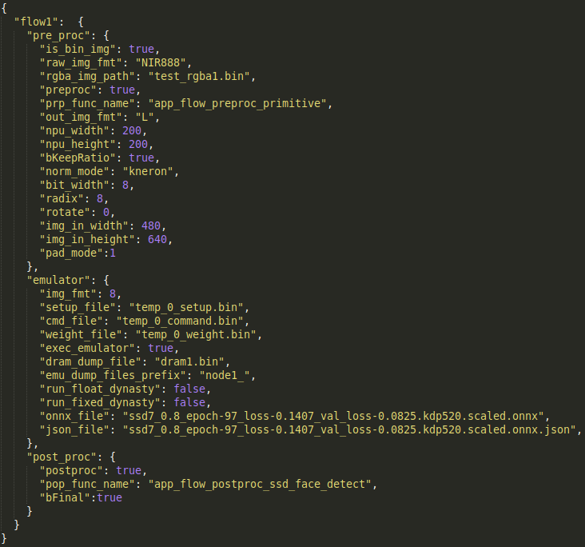

# Kneron End to End Simulator v0.6.4

This project allows users to perform image inference using Kneron's built in simulator. As of version 0.5.0 the 520 and 720 simulators have been merged into one codebase, and any existing apps will need to be updated to the new structure to work.

## File Structure

<div align="center">

<p>Example app folder structure</p>
</div>

* bin: all of the outputs that the application will dump
	* csim_dump: model inference results will be dumped here if you used CSIM
	* dynasty_dump: model inference results will be dumped here if you used Dynasty
	* out: any intermediate or output file will be dumped here
* prepostprocess: Kneron PPP library
* python_flow: all of the python code that makes up the application framework, THIS SHOULD NOT BE MODIFIED
	* common: shared classes, Python ctypes wrapper for 520/720 KDP_Image
  * dynasty: library to perform Dynasty inference
	* internal: various scripts and functions used internally, does not affect external usage
  * utils: various utility functions
  * code for controlling the simulator flow
  * various binaries and libraries for CSIM

<div align="center">

<p>Example app folder structure</p>
</div>

* app: holds example of a test application, application does not have to be placed in this folder
	* application: should hold input jsons, model files, and preprocess/postprocess files
		* flow.py: filled out by the user to create testing flows for their application, REQUIRED
    * input_jsons: input jsons MUST be placed in this folder in the application
  * template_app: template with the requirements to run the simulator
    * you can use this as a base guideline to start your application

## Configuring Input

Kneron simulator uses a JSON file to specify parameters used throughout the testing process.
<div align="center">

<p>Example input JSON configurations</p>
</div>
In each JSON, there are three sections (pre, emu, post) to define parameters necessary to complete the testing process. The parameters shown are the minimum required to run the simulator; you may add new parameters to the "pre" or "post" to pass into your preprocess or postprocess functions.


If any of the required keys are missing, the program will end. The required keys will be specified in their respective sections.
#### Preprocess Parameters
**Required keys:** pre_type

| Name           | Description                                                          | Acceptable Values                        |
|:--------------:|:--------------------------------------------------------------------:|:----------------------------------------:|
| pre_bypass     | Specifies whether preprocessing should be bypassed, default is false | true, false                              |
| **pre_type**   | Name of the preprocess function to run, in Python import format      | any preprocess function you wish to call |


#### Simulator Parameters
You only need to specify the parameters for the type of inferencer you intend to use. Paths to files should be relative to the base of your app folder or absolute.

**Required key in general**: emu_mode

**Required keys if hardware CSIM 520/720 is used:** setup_file, command_file, weight_file

**Required keys if Dynasty is used:** onnx_file/bie_file (depending on emu_mode), onnx_input

| Name          | Description                                                                                    | Acceptable Values                   |
|:-------------:|:----------------------------------------------------------------------------------------------:|:-----------------------------------:|
|  **emu_mode** | Specifies what inferencer to use                                                               | "csim", "float", "fixed", "bypass"  |
| model_type    | Used to specify output paths and files                                                         | any string                          |
| platform      | Platform of the Kneron inferencer for CSIM, default is 520                                     | 520, 720                            |
| setup_file    | Name of the binary setup file used for Kneron CSIM 520/720                                     | any string path                     |
| command_file  | Name of the binary command file used for Kneron CSIM 520/720                                   | any string path                     |
| weight_file   | Name of the binary weight file used for Kneron CSIM 520/720                                    | any string path                     |
| ioinfo_file   | Name of the CSV file to map output number to name for Kneron CSIM 520/720                      | any string path                     |
| num_inputs    | Number of inputs to the model, CSIM 520/720 only, default is 1                                 | any non-negative integer            |
| data_type     | Type of the NumPy array returned to your postprocess function, only for CSIM and Dynasty fixed | "float", "fixed"                    |
| radix         | Radix used to convert from float input to integer input used for CSIM 520/720                  | any non-negative integer            |
| bie_file      | Name of BIE file to use for the Kneron Dynasty simulator, use with "fixed" emu_mode            | any string                          |
| onnx_file     | Name of ONNX file to use for the Kneron Dynasty simulator, use with "float" emu_mode           | any string                          |
| onnx_input    | Name of the input nodes to the ONNX model                                                      | list of strings                     |
| reordering    | List of how the inference outputs should be reordered, default is []                           | list of integers or list of strings |

Note on the reordering parameter: this can be specified for your convenience in the postprocess function. By default, the inference results for CSIM and Dynasty will be returned in alphabetical order of the output file names. For CSIM, this will be in order of the outputs designated by CSIM: 1, 2, 3,... For Dynasty, this will be in order of the output node names. If you do not specify the ioinfo_file parameter, the reordering parameter for CSIM should be a list of integers, based on the output order designated by CSIM. Otherwise, it should be a list of strings, based on the output node names. The reordering parameter for Dynasty should be a list of strings, based on the output node names.

#### Postprocess Parameters
**Required keys:** post_type

| Name          | Description                                                        | Acceptable Values                         |
|:-------------:|:------------------------------------------------------------------:|:-----------------------------------------:|
| post_bypass   | Specifies whether postprocess should be bypassed, default is false | true, false                               |
| **post_type** | Name of the postprocess function to run, in Python import format   | any postprocess function you wish to call |

## Custom pre/postprocess
Since inference results can vary based on users' intentions, we provide support for integrating custom preprocess and postprocess functions. The preprocess and postprocess functions you supply into the "pre_type" and "post_type" fields must follow the API that we provide.

Both the preprocess and postprocess must take in a TestConfig class as input. For reference, you can find it defined at python_flow/common/config.py. This class is filled with parameters from the supplied input JSONs and other environment variables. To access all of those parameters, you will need to access the "config" attribute, a dictionary. There are four keys to access the dictionary: "pre", "emu", "post", and "flow". The first three keys have values that are dictionaries with the same exact values as in the JSON files. The "flow" key simply has values parsed from the command line options and other environment variables such as the input image.

The preprocess must take in as input a TestConfig class and a variable that represents anything you may want to pass into your preprocess function. The second variable may be needed if your preprocess depends on the results of a previous stage in the flow. It must output a tuple consisting of a list of NumPy arrays and a dictionary. The list of NumPy arrays should be in channel last format (1, h, w, c) and have a one-to-one correspondence with each input you have in your model. The dictionary holds any values you wish to communicate from your preprocess to your postprocess.

The postprocess must take in as input a TestConfig class, a dictionary, and a list of NumPy arrays. The TestConfig class is the same class as used in the preprocess. The dictionary is the same as the second output of your preprocess function. The last input is the results of the model inference. There will be one NumPy array per output of your model, and each array will be in channel last format (d1, d2, ..., c). The order of the output nodes will be based on the list you provided in the "reordering" field in the input JSON. The output for the postprocess can be anything that is convenient for your uses. 

For preprocess reference, you may look at app/fd_external/preprocess/fd.py. For postprocess reference, you may look at app/fd_external/postprocess/fd.py. For a template of the API, you may look at app/template_app.

### Preprocess
#### Python defined
If your preprocess functions are defined in Python, integration is simple.

1. Make sure your Python function takes two parameters as input: a TestConfig class and a prev_output variable.
2. Make sure your return value is a tuple of a list of your preprocessed NumPy arrays in channel last format and a dictionary of values to be passed to the postprocess.
3. Set the value of the "pre_type" field in the input JSON to the name of your function, as defined [here](#adding-own-flows).

#### C defined
1. Compile the C/C++ functions into a shared library (.so). Be sure to add ```extern "C"``` to any C++ functions you intend to directly call in the Python flow.
2. Copy the library into your application's directory.
3. Import the shared library into whichever module needs it using the standard ctypes module:
    ```
    MY_LIB = ctypes.CDLL("./my_lib.so")
    ```
4. Define any C/C++ structures that are needed for parameters as classes in Python. These classes must extend ```ctypes.Structure``` and store the structure fields in the "_fields_" variable. This is a list of tuples where the first item is the name of the variable, and the second item is the type of that variable. The names  and order must be defined exactly as in the C code.
5. Define a wrapper to the C/C++ function you wish to call. You need to specify three items: the function name as defined in the C code, the input argument types, and the result argument types.
6. Create a Python function that takes a TestConfig class and prev_output variable as input that calls your function wrapper. You can get the inputs you need from the TestConfig class and pass it to the wrapper as needed.
7. Make sure your return value is a tuple of a list of your preprocessed NumPy arrays in channel last format and a dictionary of values to be passed to the postprocess. You will need to translate your C preprocessed data into NumPy arrays for the return value.
8. Set the value of the "pre_type" field in the input JSON to the name of your function, as defined [here](#adding-own-flows).

Note: examples on the structure wrappers can be found under python_flow/common in the kdp_image files; examples on the function wrappers can be found under app/src/python in convert.py.

### Postprocess
#### Python defined
If your postprocess functions are defined in Python, integration is simple yet again.

1. Make sure your Python function takes three parameters as input: a TestConfig class, a dictionary, and a list of NumPy arrays.
2. Make sure your return value is whatever is convenient for your usage.
3. Set the value of the "post_type" field in the input JSON to the name of your function, as defined [here](#adding-own-flows).

#### C defined (520)
1. Like the preprocess, compile the C/C++ functions into a shared library (.so).
2. However, your postprocess C function should take in an kdp_image structure from python_flow/common/kdp_image.py, as this holds data parsed from the model binaries. For reference, the Python class is defined in python_flow/common/kdp_image.py, and the C structure is defined in app/src/postprocess/520/post_proc_interface.h.
3. Copy the library into your application's directory.
4. Import the shared library into whichever module needs it using the standard ctypes module.
5. Define any C/C++ structures and function wrappers that are needed as in the preprocess.
6. Create a Python function that takes a TestConfig class and prev_output variable as input that calls your function wrapper. You must load the output data into memory before calling your function wrapper. To do so, depending on the inferencer mode you set, call either csim_520_to_memory or dynasty_to_memory from python_flow/utils/utils.py. Example usage can be found in app/fdr_external/postprocess/fd.py under the postprocess function.
7. Make sure your return value is whatever is convenient for your usage.
8. Set the value of the "post_type" field in the input JSON to the name of your function, as defined [here](#adding-own-flows).

#### C defined (720)
1. Follow the same steps as in the 520 version. Except in step 2, the input should be a kdp_image structure from python_flow/common/kdp_image_720.py. Note that this KDPImage is different than the 520 version. The Python class is defined in python_flow/common/kdp_image_720.py, and the C structure is defined in app/src/postprocess/720/kdpio.h. In step 6, you should also call csim_720_to_memory instead if you used CSIM inferencer.
2. Accessing the data is a bit tricky, but examples can be found in app/src/postprocess/720/post_processing_fixed.c in the post_ssd_face_detection_kl720 function. Get the output node x you want by accessing the pNodePositions array for node x + 1 (the first node will be an input node). The memory location for the node data can be accessed by calling the macro OUT_NODE_ADDR(node).

There are also some conversion functions for your convenience under python_flow/utils/utils.py.
Use convert_binary_to_numpy to get a NumPy array from an input binary image. Use convert_pre_numpy_to_rgba to dump a NumPy array into RGBA binary used for CSIM.

Reminder: For C postprocess, although the inference results are supplied as input in the function, you will still need to call the utility functions csim_to_memory or dynasty_to_memory to load the data before calling your postprocess wrapper.

## Usage

```
simulator.py [-h] [-c {after,before,none}] [-d] [--dump]
                    [-f {RGB,NIR,INF,ALL}] [--fusion] [-i {binary,image}]
                    [-n NUM_IMAGES] [-r] [--rgba] [-s STAGES] [-w WORKERS]
                    app_folder image_directory test

Runs a test on multiple images

positional arguments:
  app_folder            directory of your application
  image_directory       directory of images to test
  test                  type of test to be run, should be one of the functions in your app's flow.py

optional arguments:
  -h, --help            show this help message and exit
  -c {after,before,none}, --clear {after,before,none}
                        flag to clear CSIM or Dynasty dumps
  -d, --debug           enable debug mode
  --dump                flag to dump intermediate node outputs for the simulator
  -f {RGB,NIR,INF,ALL}, --fmt {RGB,NIR,INF,ALL}
                        format of the input images to test
  --fusion              enable fusion test input
  -i {binary,image}, --inputs {binary,image}
                        type of inputs to be tested
  -n NUM_IMAGES, --num_images NUM_IMAGES
                        number of images to test
  -r, --resume          flag to resume dataset from where it left off previously
  --rgba                flag to dumb preprocessed RGBA binary
  -s STAGES, --stages STAGES
                        number of stages of the test to run through, you will need to add the check in your own test
  -w WORKERS, --workers WORKERS
                        number of worker processes to run
```

* -h: show the help message
* -c: set this option if you want to remove CSIM or Dynasty dumps
  * If set to after, it will clear after running inference - more useful if limited space
  * If set to before, it will clear before running inference - more useful if you do not want old results to somehow affect the current run
* -d: set this option if you want to see all your print statements, default will hide the prints
* --dump: set this option if you want to dump all node outputs in your model
* -f: default is "ALL", other format specifiers will filter the test images to only images with that prefix
* --fusion: set if you are using fusion input, probably will not need to use
* -i: default will look for image input (PNG, JPG, etc.)
  * If binary, will look for binary files instead
* -n: set for number of images to test, default is all of the images in the test directory
* -r: set this option if you want to resume a dataset that was previously run that ended in the middle because of crash/user stop/other error
* --rgba: set this option if you want to dump preprocessed RGBA binary when running Dynasty float/fixed, for your reference
* -s: default number is all of the stages
	* Will only be used if user calls variable in flow.py
* -w: default number is 1, similar to how many images you want to run at the same time

## Adding own application
We will go over how to create your own application for testing. It is recommended to copy the template_app folder as a base; we will refer to this application as my_app. All your application code should be placed under my_app/.

You will need the following to run your application:
* all model files that you plan on testing
	* BIE if you are running Dynasty fixed, ONNX if you are running Dynasty float
	* weight, setup, and command binaries if you are running CSIM 520/720, ioinfo CSV file is optional
* preprocess and postprocess functions
* input JSON files for each of your models
* flow.py to control the simulator flow
* a set of test images

### Model files
To get the input model files from your model, follow these steps for [520](http://doc.kneron.com/docs/#manual_520/#3-toolchain-scripts-usage) and [720](http://doc.kneron.com/docs/#toolchain/manual_720/#3-toolchain-scripts-usage). The ONNX, BIE, ioinfo CSV, and weight/setup/command binaries will all be generated upon completing step 3.2.

### Preprocess and postprocess
[Follow these steps](#custom-prepostprocess) to add your preprocess and postprocess functions. You may use app/template_app/preprocess.py and app/template_app/postprocess.py as a guideline.

### Setting up JSON
We will be using app/my_app/postprocess.py, app/my_app/preprocess.py, and app/my_app/input_jsons/example.json for this section. Reminder that all input JSON files MUST be placed under app/my_app/input_jsons. Refer to these [tables](#configuring-input) for more information about each specific parameter.

1. Fill in the "pre_type" and "post_type" fields with the corresponding functions you would like to run for preprocess and postprocess. In our case, it will be the "preprocess" and "postprocess" functions in their respective files. You want to fill in these two fields with a string that is similar to a Python import, with the import being relative to my_app/. For the "pre_type" field, it would be "preprocess.preprocess". It is essentially the relative path to the preprocess file with "." instead of "/", and with the name of your preprocess function attached to the end. It is the same case for the postprocess function.
2. Fill in the type of inferencer and Kneron platform you wish to use in "emu_mode" and "platform".
3. Fill in "model_type" with the name of your model (this is only for dumping out files). 
4. Fill in the subsection that you set in "emu_mode" with the correct values. The paths you specify may be absolute or relative to my_app/.

### Setting up flow
We will be referring to app/my_app/flow.py for this section. Do not place flow.py in another folder; it must be placed in the base folder of the application.

<div align="center">

<p>Example flow.py</p>
</div>

1. Import "flow.py" from the python_flow directory.
2. Fill in the user_config dictionary with all of the input JSON files to be used. The key should be the model name, and the value should be the path to the input JSON, relative to my_app/. The model name here does not need to match the "model_type" in the input JSON; it will just be for access in your test function. Do not change the name of "user_config."
3. Define a test function that takes in as input a list of string image files and a dictionary of models mapped to a TestConfig. ("your_test_name" in this example). The list of string image files will be of length one unless you choose the "fusion" command line option; normally you would either select bin or image (fusion is a special case).
	1. Call flow.run_simulator once for each stage in your flow. The inputs are a TestConfig class, the list of input image files, and any data you wish to pass into your preprocess function. The TestConfig class comes from accessing the user_config dictionary with the model JSON you wish to use. The preprocess input may be set to None if you do not need it.
	2. Add any extra work you may need for your testing.
4. You may return a dictionary to be dumped out to a file. The dictionary will be dumped to an output JSON file in a file called results.json with the same keys and values that you provide. There will be one results.json per input image that you provide; it will be under the bin folder following the same path as the original image. This is for convenience to see all the results for each test image that you provide.

### Running the test.
The last step is to prepare your image dataset. Your image data set can be placed anywhere. An example dataset is in app/test_image_folder.

Now, we can run the test. Arguments are explained [here](#usage). This is assuming you copied my_app into the app folder.
```
python3 simulator.py app/my_app your_test_image_folder your_test_name
```

Use this command to run the fdr example set up in app/app1:
```
python3 simulator.py app/my_app app/test_image_folder/fd fdr
```
